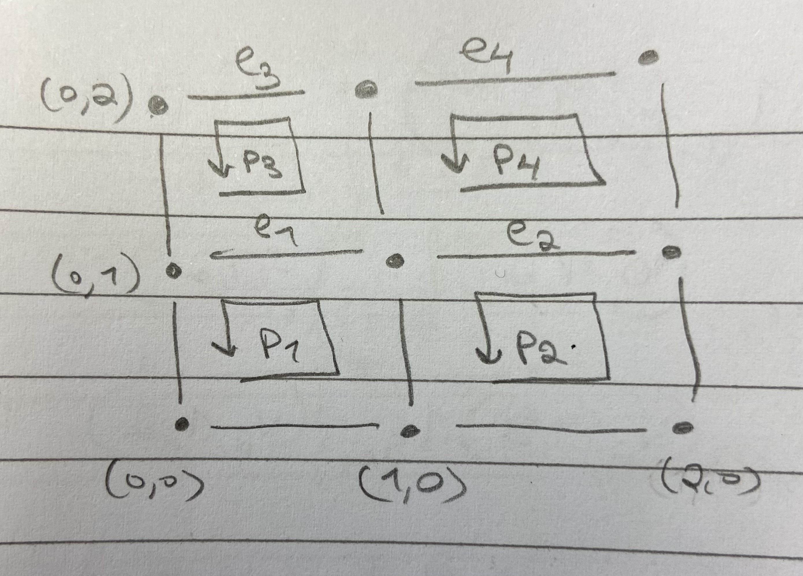

### February 27, 2026

Lang, Alegebra Chapter 19. The Alternating Product. 

The alternating product has applications throughout mathematics. 
In differential geometry, one takes the maximal alternating 
product of the tangent space to get a canonical line bundle over a
manifold. Intermediate alternating products give rise to differential
forms (sections of these products over the manifold.) In this chapter, 
we give the algebraic background for these constructions. 

Section 1. Definition and Basic Properties. 

Consider the category of modules over a commutative ring $R$. 

We recall that an $r$-multilinear map $f: E^{(r)} \to F$ is said to be
alternating if $f(x_1, \cdots, x_r) = 0$ whenever $x_i = x_j$ for 
some $i \ne j$. 

Let $\mathfrak{a}_r$ be the submodule of the tensor product 
$T^{r}(E)$ generated by all elements of type 
$$x_1 \otimes \cdots \otimes x_r$$
where $x_i = x_j$ for some $i \ne j$. 

(What does this mean? 
See page 129 @LangAlgebra for the definition of 
a submodule generated by a subset.)

We define 
$$\bigwedge^r (E) = T^r(E)/ \mathfrak{a}_r.$$

Then we have an $r-$multilinear map $E^{(r)} \to \bigwedge^r (E)$
(called canonical) obtained from the composition 
$$E^{(r)} \to T^r(E) \to T^r(E)/ \mathfrak{a}_r = \bigwedge^r(E).$$ 

### February 26, 2026

I can probably tackle the beginning of section 3
of @Chatterjee2016
with 
Lang's Algebra and 
Chapter 1 of Mirror Symmetry, which covers
Hodge Star, Curvature form, and more, 
in 25 pages or so, but at a very advanced 
level, with much of the algebra taken for granted. 

### February 24, 2026

I'm going to type out the rest of @SerreLie Chapter 1: Lie Algebras: Definitions and Examples.

Examples.

(i) Let $k$ be a complete field with respect to an absolute value, 
let $G$ be an analytic group over $k$, and let $\mathfrak{g}$ 
be the set of tangent vectors to $G$ at the origin. 
There is a natural structure of a Lie algebra on $\mathfrak{g}$.

(ii) Let $\mathfrak{g}$ be any $k$-module.
Define $[x,y] = 0$ for all $x, y \in \mathfrak{g}$. 
Such a $\mathfrak{g}$ is called a commutative Lie Algebra.

(iii) If in the preceding example we take
$\mathfrak{g} \oplus \bigwedge^2 \mathfrak{g}$ 
and define 
$$[x,y] = x \wedge y$$
$$[x, y \wedge z] = 0$$
$$[x \wedge y, z] = 0$$
$$[x \wedge y, z \wedge t] = 0$$
for all $x,y,z,t \in \mathfrak{g}$, then $\mathfrak{g} \oplus \bigwedge^2 \mathfrak{g}$ is 
a Lie algebra.

(iv) Let $A$ be an associative algebra over $k$
and define $[x,y] = xy - yx$, for all $x,y \in A$. 
Clearly $A$ with this product satisfies the axioms 1) and 2).

Definition 2. Let $A$ be an algebra over $k$.
A derivation $D: A \to A$ is a $k$-linear map
with the property $D(x \cdot y) = Dx \cdot y + x \cdot Dy$.

(v) The set $\text{Der}(A)$ of all derivations of an algebra
$A$ is a Lie algebra with the product $[D,D'] = DD' - D'D$. 
We will prove this by computation: 
\begin{align*}
[D,D'](x \cdot y) &= DD'(x \cdot y) - D'D(x \cdot y) \\
&= D(D'x \cdot y + x \cdot D'y) - D'(Dx \cdot y + x \cdot Dy) \\
&= DD'x \cdot y + D'x \cdot Dy + Dx \cdot D'y + x \cdot DD'y \\
&- D'Dx \cdot y - Dx \cdot D'y - D'x \cdot Dy - x D'Dy \\
&= DD'x \cdot y + x \cdot DD'y - D'Dx \cdot y - x \cdot D'Dy \\
&= [D,D'] x \cdot y + x \cdot [D,D'] y.
\end{align*}

Theorem 3. Let $\mathfrak{g}$ be a Lie algebra. For any $x \in \mathfrak{g}$
define a map $\text{ad}x: \mathfrak{g} \to \mathfrak{g}$ by 
$$\text{ad}x(y) = [x,y],$$
then 

1. $\text{ad}x$ is a derivation of $\mathfrak{g}$.

2. The map $x \mapsto \text{ad}x$ is a Lie homomorphism
of $\mathfrak{g}$ into $\text{Der}(\mathfrak{g})$.

Proof. 
\begin{align*}
\text{ad}x[y,z] &= [x,[y,z]] \\
&= -[y,[z,x]] - [z,[x,y]] \\
&= [[x,y],z] + [y,[x,z]] \\
&= [\text{ad}x(y), z] + [y, \text{ad}x(z)],
\end{align*}
hence 1. is equivalent to the Jacobi identity.

Now 
\begin{align*}
\text{ad}[x,y](z) &= [[x,y],z] \\
&= -[[y,z],x] - [[z,x],y] \\
&= [x,[y,z]] - [y,[x,z]] \\
&= \text{ ad}x \text{ ad}y(z) - \text{ ad}y \text{ ad} x(z) \\
&= [\text{ ad}x, \text{ ad}y](z),
\end{align*}
hence (2) is also equivalent to the Jacobi identity.

(vi) The Lie Algebra of an algebraic matrix group.

Let $k$ be a commutative ring and let $A = M_n(k)$ be the algebra of 
$n \times n$ matrices over $k$. Given a set of polynomials
$P_\alpha(X_{ij})$ for $1 \le i,j \le n$, a zero of $(P_\alpha)$
is a matrix $x = (x_{ij})$ such that $x_{ij} \in k$ and $P_\alpha(x_{ij}) = 0$ for all $\alpha$.

Let $G(k)$ denote the set of zeroes of $(P_\alpha)$.
If $k'$ is any associative, commutative $k$-algebra, we have analogously 
that $G(k') \subset M_n(k')$.

Definition 4. The set $(P_\alpha)$ defines an algebraic
group over $k$ if $G(k')$ is a subgroup of $GL_n(k')$ for all associative, 
commutative $k$-algebras $k'$.

The orthogonal group is an example of an algebraic group (equation: $X^t \cdot X = 1$.)

Now let $k'$ be the $k$-algebra which is free over $k$
with basis $\{1, \epsilon \}$ where $\epsilon^2 = 0$, i.e., $k' = k[\epsilon]$.

Theorem 5. Let $\mathfrak{g}$ be the set of matrices
$X \in M_n(k)$ such that $1 + \epsilon X \in G(k[\epsilon])$. Then
$\mathfrak{g}$ is a Lie subalgebra of $M_n(k)$.

Proof. We have to prove that $X, Y \in \mathfrak{g}$ implies that 
$\lambda X + \mu Y \in \mathfrak{g},$ for $\lambda, \mu \in k$
and $XY - YX \in \mathfrak{g}$. 

To prove that, note first that
$$P_{\alpha} (1 + \epsilon X) = 0 \text{ for all } \alpha \Leftrightarrow X \in \mathfrak{g}$$
and since $\epsilon^2 = 0$, we have 
$$P_\alpha(1 + \epsilon X) = P_\alpha(1) + dP_\alpha(1) \epsilon X.$$
But $1 \in G(k)$, i.e. $P_\alpha(1) = 0$; therefore
$$P_{\alpha}(1 + \epsilon X) = dP_\alpha(1) \epsilon X.$$
Hence, $\mathfrak{g}$ is a submodule of $M_n(k)$.

We introduce now an auxilliary algebra $k''$ given by
$k'' = [\epsilon, \epsilon', \epsilon'\epsilon]$
where $\epsilon^2 = \epsilon'^2 = 0$ and 
$\epsilon' \epsilon = \epsilon \epsilon'$, 
i.e., $k'' = k[\epsilon] \otimes_k k[\epsilon']$.

Let $X,Y \in \mathfrak{g}$, so we have 
$$g = 1+ \epsilon X \in G(k[\epsilon]) \subset G(k'')$$
$$g' = 1 + \epsilon' Y \in G(k[\epsilon']) \subset G(k'')$$
$$gg' = (1 + \epsilon X)(1 + \epsilon' Y) = 1 + \epsilon X + \epsilon Y' + \epsilon \epsilon' XY$$
$$g'g = 1 + \epsilon X + \epsilon' Y + \epsilon \epsilon' YX.$$

Write $Z = [X,Y]$; 
$$gg' = g'g(1+\epsilon \epsilon' Z).$$
Since $gg', g'g \in G(k'')$, it follows that
$$1 + \epsilon \epsilon' Z \in G(k'').$$
But the subalgebra $k[\epsilon \epsilon']$ of $k''$ may be identified
with $k[\epsilon]$. It then
follows that 
$1 + \epsilon Z \in G(k[\epsilon])$, hence $Z \in \mathfrak{g}$. q.e.d.

Example. The Lie Algebra of the orthogonal group is the set of matrices 
$X$ such that $(1 + \epsilon X) (1 + \epsilon X^t) = 1$, i.e., $X + X^t = 0$.

### February 23, 2026

#### Tensor and Exterior Algebras

I'm just going to type out the beginning of Chapter 2 of @Warner.

Let $V$, $W$, and $U$ denote finite dimensional real vector spaces. 
$V^*$ will denote the dual space of $V$ consisting of all 
real-valued linear functions on $V$. 

Let $F(V,W)$ be the free vector space over $\mathbb R$ whose generators
are the points of $V \times W$. Thus, $F(V,W)$ consists of 
all finite linear combinations of pairs $(v,w)$ with $v \in V$ and
$w \in W$. Let $R(V,W)$ be the subspace of $F(V,W)$ generated by 
the set of all elements of $F(V,W)$ of four distinct forms. 

$$(v_1 + v_2, w) - (v_1, w) - (v_2, w)$$
$$(v,w_1 + w_2) - (v,w_1) - (v,w_2)$$
$$(av,w) - a(v,w)$$
$$(v,aw) - a(v,w)$$

for $v, v_1, v_2 \in V$ 
and $w, w_1, w_2 \in W$ 
and $a \in \mathbb R$. 

The quotient space $F(V,W)/R(V,W)$ is called the tensor product
of $V$ and $W$ and is denoted by $V \otimes W$. 
The coset of $V \otimes W$ containing the element 
$(v,w)$ of $F(V,W)$ is denoted by $v \otimes w$. 
It follows from the form of the elements in $R(V,W)$ that 
we have the following identities in $V \otimes W$: 

$$(v_1 + v_2) \otimes w = v_1 \otimes w + v_2 \otimes w$$
$$v \otimes (w_1 + w_2) = v \otimes w_1 + v \otimes w_2$$

$$a(v \otimes w) = av \otimes w = v \otimes aw.$$

The following properties of the tensor product can 
be established, as exercises. 

(a) Universal mapping property. Let $\phi$ denote the 
bilinear map $(v,w) \mapsto v \otimes w$ of $V \times W$ into
$V \otimes W$. Then whenever $U$ is a vector space 
and $l: V \times W \to U$ is a bilinear map, there exists 
a unique linear map $\tilde{l}: V \otimes W \to U$ 
such that 
$$l = \tilde{l} \circ \phi.$$ 
The pair consisting of $V \otimes W$ and $\phi$ is said to 
solve the universal mapping problem for bilinear maps 
with domain $V \times W$. Moreoever, $V \otimes W$ and 
$\phi$ are unique with this property in the sense 
that if $X$ is a vector space and $\tilde{\phi} V \times W \to X$ 
a bilinear map with the above universal mapping property, 
then there exists an isomorphism 
$\alpha: V \otimes W \to X$ such that 
$\alpha \circ \phi = \tilde{\phi}$. 

Proof 

Note that $(v \otimes w)_{(v,w) \in V \times W}$ generates $V \otimes W$.
Let $x \in V \otimes W$ be arbitrary. 
Then $x = \sum_{i=1}^n a_i(v_i \otimes w_i)$
for some $a_i \in \mathbb R$, and $(v_i,w_i) \in V \times W$.
For $v \otimes w \in V \otimes W$, define
$\tilde{l}(v \otimes w) = l(v,w)$. 
Then extend by linearity to an abitrary $x$ by: 
$$
\tilde{l}(x) := \sum_{i=1}^n a_i l(v_i,w_i).
$$

(b) $V \otimes W$ is canonically isomorphic to $W \otimes V$. 

(c) $V \otimes (W \otimes U)$ is canonically isomorphic with 
$(V \otimes W) \otimes U$.

(d) By property (a), the bilinear map of $V^* \times W$ into the vector space
$Hom(V,W)$ of linear transformations from $V$ to $W$ 
defined by
$$V^* \times W \ni (f,w) \mapsto (V \ni v \mapsto f(v)\cdot w \in W) \in Hom(V,W)$$
determines uniquely
a linear map $\alpha: V^* \otimes W \to Hom(V,W)$. $\alpha$ is an isomorphism. 
As a consequence 
$$
\dim V \otimes W = (\dim V)(\dim W).
$$

Proof 

$\alpha$ is defined similarly as in (a). 
We must find a linear map (morphism of vector spaces) $g: Hom(V,W) \to V^* \otimes W$
such that $\alpha \circ g = I \in \text{Mor}(\text{Hom}(V,W),\text{Hom}(V,W))$
and $g \circ \alpha = I \in \text{Mor}(V^* \otimes W, V^* \otimes W).$

Let $v_1, \cdots, v_n$ and $w_1, \cdots, w_k$ be bases
for $V$ and $W$ respectively. Let $f_1, \cdots, f_n$ be the 
dual basis of $V^*$ with respect to $v_1, \cdots, v_n$. 
By Theorem 4.1 Lang Algebra, for each $i \in [n]$ and $j \in [m]$, 
there is a unique linear map $f_{ij}: V \to W$ such that
$$
f_{ij}(v_l) = \begin{cases}
w_j & \text{ if l = i} \\
0 & \text{ if } l \ne i.
\end{cases}
$$
In other words, $f_{ij}$ maps $v_i$ to $w_j$ and 
otherwise sends the other basis elements of $V$ to $0 \in W$.
Then $f_{ij}$ can be written in terms of the 
dual basis as 
$$f_{ij}(x) = f_i(x)w_j,$$
for any $x \in V$.

Now let $g: Hom(V,W) \to V^* \otimes W$ 
map $f_{ij} = f_i \cdot w_j$ to $f_i \otimes w_j$, 
and extend by linearity to the rest of $\text{Hom}(V,W)$.

Then for $\sum_i x_i (d_i \otimes w_i)$ where 
$x_i \in \mathbb R$, $d_i \in V^*$, and $w_i \in W$ are arbitrary
for $i \in [k]$ for some $k$, we have that
\begin{align*}
g \circ \alpha (\sum_i x_i (d_i \otimes w_i)) &= \sum_i x_i g \circ \alpha(d_i \otimes w_i) \\
&= \sum_i x_i g \circ \alpha(\sum_l d_{il}f_l \otimes \sum_m w_{im} w_m)\\
&= \sum_i x_i g \circ \alpha(\sum_{l,m} d_{il} w_{im} (f_l \otimes w_m))\\
&= \sum_i x_i \sum_{l,m} d_{il} w_{im} g \circ \alpha (f_l \otimes w_m) \\
&= \sum_i x_i \sum_{l,m} d_{il} w_{im} g (f_{lm}) \\
&= \sum_i x_i \sum_{l,m} d_{il} w_{im} (f_l \otimes w_m) \\
&= \sum_i x_i (d_i \otimes w_i).
\end{align*}

(e) Let $\{e_i: i = 1, \cdots, c\}$ and 
$\{f_j: j = 1, \cdots, d\}$ be bases for $V$ and $W$ respectively. 
Then $\{e_i \otimes f_j: i = 1, \cdots, c \text{ and } j = 1, \cdots, d\}$
is a basis of $V \otimes W$. 

Further definitions.
The tensor space $V_{r,w}$ of type $(t,s)$ associated
with $V$ is the vector space 
$$
V \otimes \cdots \otimes V \otimes V^* \otimes \cdots \otimes V^*
$$
with $r$ copies of $V$ and $s$ copies of $V^*$. 
The direct sum 
$$ 
T(V) = \sum_{r,s \ge 0} V_{r,s},
$$
where $V_{0,0} = \mathbb R$
is called the tensor algebra of $V$. 
Elements of $T(V)$ are finite linear combinations 
over $\mathbb R$ of elements of the various $V_{r,s}$ 
and are called tensors. 
$T(V)$ is a non-commutative, associative, graded algebra
under $\otimes$ multiplication, 
where if $u = u_1 \otimes \cdots \otimes u_{r_1} \otimes u_1^* \otimes \cdots \otimes u_{s_1}^*$
belongs to $V_{r_1, s_1}$ and 
$v = v_1 \otimes \cdots \otimes v_{r_2} \otimes v_1^* \otimes \cdots \otimes v_{s_2}^*$
belongs to $V_{r_2, s_2}$, then there 
product $u \otimes v$ is defined by
$$
u \otimes v = u_1 \otimes \cdots \otimes u_{r_1} \otimes v_1 \otimes \cdots \otimes v_{r_2} \otimes u_1^* \otimes \cdots \otimes u_{s_1}^* \otimes v_1^* \otimes \cdots \otimes v_{s_2}^*
$$
and belongs to $V_{r_1 + r_2, s_1 + s_2}$. 
Tensors in a particular tensor space $V_{r,s}$
are called homogeneous of degree $(r,w)$. A homogeneous tensor 
(of degree (r,s) say) is called decomposable 
if it can be written in the form 
$$
v_1 \otimes \cdots \otimes v_r \otimes v_1^* \otimes \cdots \otimes v_2^*
$$
where $v_i \in V$ and $v_j^* \in V^*$.

Definitions. We let $C(V)$ denote the subalgebra 
$\sum_{k = 0}^\infty V_{k,0}$ of $T(V)$.
Let $I(V)$ be the two-sided ideal in $C(V)$ generated by the set of elements of
the form $v \otimes w$ for $v \in V$, and set 
$$
I_k(V) = I(V) \cap V_{k,0}.
$$
It follows that 
$$
I(V) = \sum_{k=0}^{\infty} I_k(V),
$$
and is a graded ideal in $C(V)$. The exterior algebra $\Lambda(V)$ of $V$ is the 
graded algebra 
$C(V) / I(V).$ If we set 
$$
\Lambda_k(V) = V_{k,0} / I_k(V)
$$
for $k \ge 2$ and 
$\Lambda_0(V) = \mathbb R$
and $\Lambda_1(V) = V$, 
then 
$$
\Lambda(V) = \sum_{k=0}^\infty \Lambda_k(V).
$$
We shall denote 
multiplication in the algebra $\Lambda(V)$ by $\wedge$. 
This is called the wedge or exterior product. 
In particular, the residue class containing 
$v_1 \otimes \cdots \otimes v_k$ is $v_1 \wedge \cdots \wedge v_k$.

Definition. A multilinear map $h: V \times \cdots \times V \to W$ with $r$ copies
of $V$ is called alternating if $h(v_{\pi(1)}, \cdots, v_{\pi(r)}) = (Sgn \pi)h(v_1, \cdots, v_r)$
for all permutations $\pi$ in the permutation group $S_r$ on $r$ letters. 
$Sgn \pi$ is the sign of the permutation $\pi$ 
(+1 if $\pi$ is even and -1 if $\pi$ is odd). 
The vector space of all alternating multilinear functions 
$V \cdots V \to \mathbb R$ with $r$ copies of $V$ 
will be denoted by $A_r(V)$, and for convenience we 
set $A_0(V) = \mathbb R$. 

2.6. The following properties of the exterior algebra can be proven as
exercises. 

(a) If $u \in \Lambda_k(V)$ and $v \in \Lambda_l(V)$, then $u \wedge v \in \Lambda_{k+l}(V)$
and $u \wedge v = (-1)^{kl} v \wedge u$. 

(b) If $e_1, \cdots, e_d$ is a basis of $V$, then
$$\{e_\Phi \}$$
is a basis of $\Lambda(V)$, 
where $\Phi$ runs over all subsets of $\{1,\cdots, d\}$,
including the empty set; where $e_\Phi = e_{i_1} \wedge \cdots \wedge e_{i_r}$
with 
$i_1 < \cdots < i_r$ where $\Phi$ is the subset $\{i_1, \cdots, i_r\}$ 
of $\{1, \cdots, d\}$; and where $e_{\Phi} = 1$
when $\Phi = \emptyset$.
In particular, 
$$\Lambda_d(V) \cong \mathbb R$$
and 
$$\Lambda_{d+j}(V) = \{0\}
$$
for $j > 0$. 
Moreover, it follows that 
$$\dim \Lambda(V) = 2^d,$$
$$\dim \Lambda_k(V) = \binom{d}{k} = \frac{d!}{k!(d-k)!}$$
where $0 \le k \le d$.

(Hint: Observe that the elements $\{e_\Phi \}$
span $\Lambda(V)$. To prove that they are also 
linearly independent, first prove that $e_1 \wedge \cdots \wedge e_d$
is not zero in $\Lambda_d(V)$. For this, 
one must show that $e_1 \otimes \cdots \otimes e_d$ 
does not belong to $I(V)$. Express an arbitrary 
element of $I(V)$ in terms of the basis 
vectors $e_1, \cdots, e_d$, and show that it could not 
equal $e_1 \otimes \cdots \otimes e_d$. 
Then for the linear independence of the entire set
$\{e_\Phi\}$, multiply the equation
$\sum a_\Phi e_\Phi = 0$ by suitable products of the $e_i$ 
to land in $\Lambda_d(V)$, and conclude that the various 
$a_\Phi$ are all zero.) 

(c) Universal Mapping Property. Let $\phi$ denote the mapping
$(v_1, \cdots, v_k) \mapsto v_1 \wedge \cdots v_k$ 
of $V \times \cdots \times V$ ($k$ copies) into $\Lambda_k(V)$. 
Then $\phi$ is a an alternating multilinear map. Now to each 
alternating multilinear map $h$ of $V \times \cdots \times V$ ($k$ copies)
into a vector space $W$, there corresponds uniquely a linear map
$\tilde{h}: \Lambda_k(V) \to W$ such that 
$$
\tilde(h) \circ \phi = h.
$$
The pair consisting of $\Lambda_k(V)$ and $\phi$ 
is said to solve
the universal mapping 
problem for alternating multilinear maps 
with domain $V \times \cdots \times V;$
and this is the unique solution in the sense that 
if $X$ is a vector space and $\tilde{\phi}: V \times \cdots \times V \to X$
an alternating multilinear map also possessing the universal 
mapping property for alternating 
multilinear maps with domain $V \times \cdots \times V$, then 
there is an isomorphism $\alpha: \Lambda_k(V) \to X$ such that 
$\alpha \circ \phi = \tilde{\phi}$. 

In the special case in which $W = \mathbb R$, the diagram given by
the relation $\tilde(h) \circ \phi = h$ establishes a natural 
isomorphism 
$$
\Lambda_k(V)^* \cong A_k(V)
$$
of $\Lambda_k(V)^*$ with the vector space $A_k(V)$ 
of all alternating 
multilinear functions on $V \times \cdots \times V$ ($k$ copies). 
It follows from property (b) that $A_k(V) = \{0\}$ for $k > \dim V$.

#### Serre's defintion of a Lie Algebra

Let $k$ be a commutative ring with unit element. Let
$A$ be a $k$-module. Then $A$ is said to be a $k$-algebra if 
there is given a $k$-bilinear map $A \times A \to A$. 
In other words, there is a $k$-homomorphism 
$$A \otimes_{k} A \to A.$$

Definition 1. A Lie Algebra over $k$ is an algebra with 
the following two properties. The first property is as follows. The map 
$$A \otimes_k A \to A$$
admits a factorization
$$A \otimes_k A \to \bigwedge^2 A \to A.$$ 
In other words, if we denote the image of $(x,y)$ by
$[x,y]$ under this map, then the condition becomes 
$$
[x,x] = 0
$$
for all $x \in k$.
The second property is as follows. 
$$
[[x,y],z] + [[y,z],x] + [[z,x],y] = 0
$$
which is known as Jacobi's identity. 

#### Warner's Definition of a Lie Algebra

A Lie Algebra $\mathfrak{g}$ over $\mathbb R$ is a real vector space
$\mathfrak{g}$ together with a bilinear operator
$[ , ]: \mathfrak{g} \times \mathfrak{g} \to \mathfrak{g}$ (called the bracket)
such that for all $x,y, z \in \mathfrak{g}$, 

(a) $[x,y] = -[y,x]$ (anti-commutativity)
(b) $[[x,y],z] + [[y,z],x] + [[z,x],y] = 0$ (Jacobi identity)

#### Real or Complex vector spaces?

I'm a bit confused why real Lie Algebras are considered and not
complex ones. 
Let me reason through the following example.
Note that $\mathfrak{gl}(n, \mathbb C)$ is the $2n^2$-dimensional (real)
Lie Algebra obtained by endowing $M(n, \mathbb C)$ with the commutator bracket according to
@LeeSM. 

Viewed as a complex vector space, $M(n, \mathbb C)$ is $n^2$ dimensional, 
because it has a basis of the 
$n^2$ matrices given by putting 1 at one entry 
and 0 at all other entries. 
If $T$ is an arbitrary complex matrix with
$n^2$ entries, then you can see that 
the aforementioned basis is truly a basis 
by decomposing $T$ into a real part
and an imaginary part, and then 
proceeding in the obvious way.

On the other hand, viewed as a real vector space, 
$M(n, \mathbb C)$ is $2n^2$ dimensional. This time a possible
basis is $(\delta_{k,l})_{k,l \in [n]}$ concatenated with 
$(\sqrt{-1} \delta_{k,l})_{k,l \in [n]}$.

### February 20, 2026

#### Notes on Chatterjee Leading Term paper

I want to compute the matrix of 
the form $M_n^0$ in some simple cases. 
Note that $M_n^0: \mathbb R^{E_n^1} \times \mathbb R^{E_n^1} \to \mathbb R$, 
and the matrix to $M_n^0$, denote it $l_n^0$, satisfies 
$l_n^0 : E_n^1 \times E_n^1 \to \mathbb R.$ Note that this is a slightly
ambiguous definition of a matrix because we haven't
defined an ordering on the edges. This will become 
important for defining a determinant of $l_n^0$.
Furthermore, the matrix to the form satisfies
$$l_n^0(e_i, e_j) = M_n^0(1_{e_i}, 1_{e_j}),$$
where 
$1_{e_j} : E_n^1 \to \mathbb R$ is given by 
$$
1_{e_j}(e) = \begin{cases}
1 & \text{if }e = e_j\\
0 & \text{if }e \ne e_j
\end{cases}
$$
for all $e \in E_n^1$.
Recall also that 
$$M_n^0(t,s) = \sum_{p \in \mathcal{P}} t(p) s(p)$$
for $(t,s) \in \mathbb R^{E_n^1} \times \mathbb R^{E_n^1}$, 
where $t(p) = t(p^{1}) + t(p^{2}) - t(p^{3}) - t(p^{4})$, 
where $p$ is a plaquette and $p^i$ are the positively oriented
edges comprising the plaquette. 
Note also that 
$M_n^0$ is symmetric:
$$
M_n^0(t,s) = M_n^0(s,t).
$$

When $n=4$, 
the matrix to $M_4^0$ is a $9$ by $9$ matrix 
because there are $9$ edges in $E_4^1$. When
$n=3$, the matrix to $M_3^0$ is a $4$ by $4$ matrix
because there are $4$ edges in $E_3^1$. In this case, by symmetry, 
we need to compute 
$10$ entries of a $16$ entry matrix.

Thus, let's compute $l_3^0$. So we consider the box $B_3$.
Let 
$$e_1 = ((0,1),(1,1))$$
$$e_2 = ((1,1),(2,1))$$
$$e_3 = ((0,2),(1,2))$$
$$e_4 = ((1,2),(2,2))$$
be shorthand notation 
for the edges in $E_3^1$.
The plaquettes are 
$$p_1 = ((0,0), 1,2)$$
$$p_2 = ((1,0), 1,2)$$
$$p_3 = ((0,1), 1,2)$$
and
$$p_4 = ((1,1), 1,2).$$

Then 
$$
l_3^0 = \begin{bmatrix}
2 & 0 & -1 & 0 \\
0 & 2 & 0 & -1 \\
-1 & 0 & 1 & 0 \\
0 & -1 & 0 & 1 \\
\end{bmatrix}
$$
where row $i$ and column $j$ has $l_3^0(e_i,e_j)$, 
which was an arbitrary way to arrange the matrix, based on
the choice of the shorthand notation 
for the edges in $E_3^1$.

As an example computation, we have
\begin{align*}
l_3^0(e_1, e_1) &= M_n^0(1_{e_1},1_{e_1})\\
&= 1_{e_1}(p_1)1_{e_1}(p_1) + \cdots + 1_{e_1}(p_4)1_{e_1}(p_4)\\
&= (-1)(-1) + (0)(0) + (1)(1) + (0)(0)\\
&= 2.
\end{align*}

It is interesting how the edges $e_3$ and $e_4$ on 
the boundary only have one plaquette that 
gives a non-zero term, 
where the edges $e_1$ and $e_2$ which are in the interior of
the box, have two plaquettes, $p_1$ and $p_3$, and $p_2$ and $p_4$, respectively, 
whcih give a non-zero term in the quadratic form on the diagonal.

### February 12, 2026

For $x \in (-1,1)$, we know that 
$$
\log(1-x) = - \sum_{i=1}^{\infty} \frac{c^i}{i}.
$$

Also, in functional analysis, bounded operators from one Hilbert 
space to another can be viewed as points in a Banach space. 

Using this abstraction, would we define, treating $L: \mathcal{H} \to \mathcal{H}$ like 
$x$ as above,  
for $\lVert L \rVert_{op} \in (-1,1)$, 
the following?
$$
\log(1-L) = - \sum_{i=1}^{\infty} \frac{L^i}{i}
$$

Or more useful could be the following. 
For $c \in (0,2)$ we know that
$$
\log(c) = -\sum_{i=1}^{\infty} \frac{(1-c)^i}{i} = \sum_{i=1}^{\infty} (-1)^{i+1} \frac{(c-1)^i}{i},
$$
so would we then define for 
$\lVert L \rVert_{op} \in (0,2)$,
that
$$
\log(L) =  \sum_{i=1}^{\infty} \frac{(-1)^{i+1}}{i} (L-I)^i,
$$
where $I$ denotes the identity operator?

### February 8, 2026

The following post is regarding @BrenneckeCQFT. 

In (3.14), we have for $f \in S(\mathbb R^4)$ that 
$$
\phi(f) = \sqrt{2 \pi} \int_{S_m^+} \lambda_m(dp) \tilde{f}(p) a_p + h.c.
$$
Straying slightly from the exact formulation (2.21), which 
is over $\mathbb R^4$ instead of the mass shell, let us identify
$$
a(g) = \int_{S_m^+} \lambda_m(dp) \overline{g}(p) a_p. 
$$
This suggests to write,
$$
\phi(f) = a(\sqrt{2 \pi} \overline{\tilde{f}(\cdot)}) + h.c. 
$$
But then the issue is that $\sqrt{2 \pi} \overline{\tilde{f}(\cdot)}$ is 
a Schwartz function on $\mathbb R^4$, and in this setting, we want 
annihilation operators to be defined by $L^2(S_m^+)$ functions. 

Does it work to simply write (?): 
$$
\phi(f) = a(\sqrt{2 \pi} \overline{\tilde{f}(\cdot)}|_{S_m^+}) + h.c. 
$$
where
$\sqrt{2 \pi} \overline{\tilde{f}(\cdot)}|_{S_m^+}$ denotes the restriction 
to $S_m^+$? 

### February 4, 2026

In this section I want collect short summaries of ideas 
and arguments from the Wightman axioms. I'll just write a bunch of short
little paragraphs. I want to be tolerant of mistakes. In particular, 
I want to make mistakes and not over-verify that things are correct. 

Let me start with the state transformation law for the Wightman axioms. 
The main idea is that you collect a Hilbert space $\mathcal{H}$, 
a representation $U$ of the covering group of the Poincaré group, 
and a vacuum state $\Omega$. But the mathematically demanding 
part is to invoke self-adjoint operator theory 
to obtain the 4-momentum $P$, and to use ideas from special relativity 
to 

One establishes a Hilbert space of states $\mathbb H$. 
Then the state transformation law with regards to change of reference frames 
is given WLOG by an ordinary representation of the inhomogeneous $SL(2, \mathbb C)$.
So we can just write $U(a,L(A))$ for $(a,A)$ in the covering space.  

We can obtain one coordinate of the 
4 momentum $P$ by partial diffentiating the strongly continuous family 
of unitary operators $U(a,L(1_{\mathbb C^{2 \times 2}}))_{a \in \mathbb R^4}$
at $(0,0,0,0)$ and multiplying by $i$.  

Notes:

- Note that for lifing the representation $U(\cdot, \cdot)$
of $\mathcal{P_+^\uparrow}$ to the 
cover $\mathbb R^4 \rtimes SL(2, \mathbb C)$
with the covering map $L: SL(2, \mathbb C) \to \mathcal{L}_+^{\uparrow}$, 
I can just think of the equation $$
U(a,(\cdot)) \circ L(\cdot) = \tilde{U}(a,(\cdot))
$$
on the covering space $SL(2,\mathbb C)$.
- To see the difference between direct product and tensor product,
form a basis of $\mathbb R^2 \oplus \mathbb R^3$ by concatenation, 
but form a basis of $\mathbb R^2 \otimes \mathbb R^3$ by
forming all combinations of elementary elements $e_i \otimes e_j$ for 
$i \in \{1,2\}$ and $j \in \{1,2,3\}$. 
 

### February 2, 2026

Here is a list of "high-level" questions that
will guide me as I try to learn the contents
of @BrenneckeCQFT. 

Questions: 

1. How is the analytic structure of the Poincaré group 
or its covering group used? Does this relate to the Laplace transform?

2. What is known about the Laplace transform? 

3. What is the connection between the Laplace transform and Wightman functions? 
Can I write down a rigorous statement that frames
Wightman functions as boundary values of holomorphic functions, and 
relate this to the Laplace transform? 

4. Why is a Haar measure needed in section 3.2? 

5. Is it true that I can safely ignore the 
unitarian trick in Section 1.2? 

6. Can I state a precise definition of the covering group 
of the Poincaré group together with group laws, and 
say how one lifts projective representations of the Poincaré 
group to unitary representations of its covering group? 

7. Some sections describe explicit formulas
for representations of the Poincaré group on 
the space of wave functions. See Section 3.1 for example. 
Is there some result that says whether 
these formulas are canonical or general? 

8. At some point, Brennecke said that we have classified
all finite dimensional irreducible representations of $X$ group
on $Y$ vector space. What are $X$ and $Y$? What is the precise
result or statement? Is this connected somehow to 
the transformation behavior Wightman axiom or the 
regularity of the field Wightman axiom? 

9. What are some of the basic definitions involving spin? 
For instance, recall $\prod$, $S$, etc. 

10. What is the role of the parity operator? What even is it? 

11. Is there a bridge between the following three lands: 
the land of distribution theory, the land of operator theory (Fock space, spectral
theorem, quantum mechanics, quantization, unitary dynamics), and representation
theory?

##### Answer to Question 1

It seems the analytic structure of the covering group of the Poincaré 
group is used in the proof of Lemma 3.11. Basically, 
one analyzes the Lie algebra of $SL(2, \mathbb C)$ in order to 
find finite dimensional irreducible representations of $SL(2,\mathbb C),$
but one needs an extra lemma regarding a local diffeomorphism property
of an exponential map from 
Lie algebra to Lie group, which requires 
a smooth structure on $SL(2, \mathbb C)$ (the Lie group in this case).

Such an analytic structure does not appear to be related to 
the Laplace transform or any of its related support requirements 
in QFT. 

