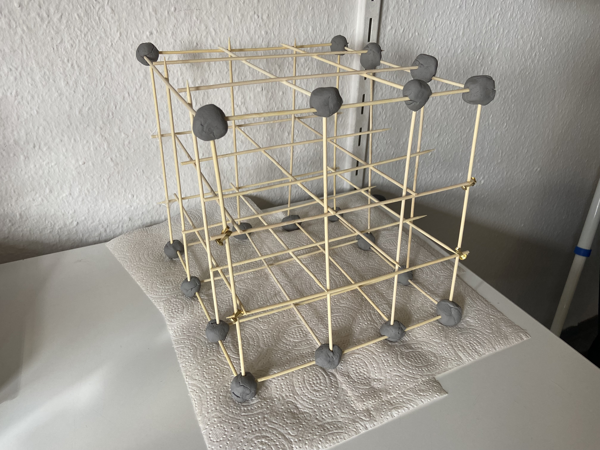
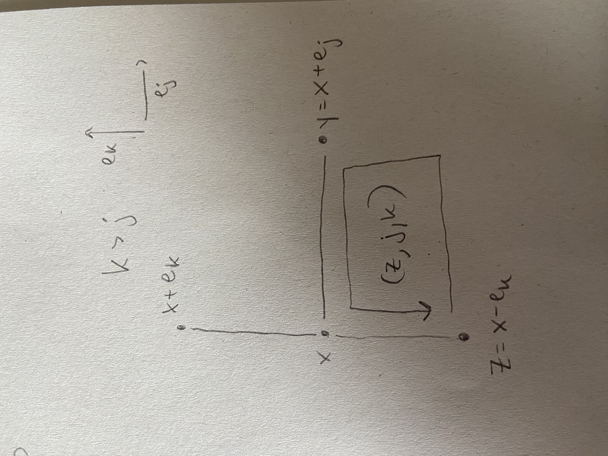

### March 19, 2026

#### Annotation of Paragraph defining Lattice Maxwell theory

I follow page 31 of @Chatterjee2016.

By the lower bound from the lemma (13.1)
and the criterion (12.2) discussed in section 12, 
the quadratic form $M_{E,0,n}$ defines a Gaussian measure on $T_E(B_n)$.

(Let $E_n^0 \subset E \subset E_n$ and 
recall that $T_E(B_n) = \mathbb R^{E_n \setminus E}$.
Note $M_{E,0,n}$ corresponds to a symmetric bilinear form 
$M_{E,0,n}: T_E(B_n) \times T_E(B_n) \to \mathbb R$. Let 
$\mathfrak{B}$ denote the standard basis of $T_E(B_n)$.
That is 
$\mathfrak{B} = \{1_e \mid e \in E_n \setminus E\}$
where $1_e$ denotes the indicator function for the edge $e$.
Then the matrix of the bilinear form $M_{E,0,n}$,
let's call it $Q_{E,0,n}$ satisfies the equation
$$
M_{E,0,n}(t,s) = t^T \cdot Q_{E,0,n} \cdot s,
$$
where on the right side, 
$t$ denotes the column vector in $\mathbb R^{|E_n \setminus E|}$
for the coordinates of $t$ with respect to the basis $\mathfrak{B}$, 
and similarly for $s$. Equivalently, 
$$
Q_{E,0,n}(e_i,e_j) = M_{E,0,n}(1_{e_i},1_{e_j}),
$$
where $Q_{E,0,n}(e_i,e_j)$ denotes the $(e_i,e_j)$ entry 
of $Q_{E,0,n}$ viewed as a matrix indexed by edges.

All that was actually meaningless commentary because we can simply define 
the function 
$e^{-M_{E,0,n}(t)}: \mathbb R^{E_n \setminus E} \to \mathbb R,$
and the fact that $M_{E,0,n}(t) = t^T Q_{E,0,n} t$ is positive definite, 
implies that $e^{-M_{E,0,n}(t)}$ is integrable, and defines a density function 
for a Gaussian measure $\tau_{E,0,n}$ with respect to Lebesgue measure.)

### March 18, 2026

#### Lattice Maxwell Action as a difference of Dirichlet Forms

Let $s, t \in T(B_n) = \mathbb R^{E_n}$.
Recall that $M_n: T(B_n) \times T(B_n) \to \mathbb R$
is given by
$$M_n(s,t) = \sum_{(x,j,k) \in B_n'} (s(e^1) + s(e^2) - s(e^3) - s(e^4))(t(e^1) + t(e^2) - t(e^3) - t(e^4))$$
where, given $(x,j,k) \in B_n'$, we have let
$e^1 = (x, x + e_j)$, 
$e^2 = (x+ e_j, x + e_j + e_k)$,
$e^3 = (x + e_k, x + e_j + e_k)$,
and $e^4 = (x, x + e_k)$.

Recall the notion of positive and negative neighbors from @BrenneckeLattice.

Define 
$N_n: T(B_n) \times T(B_n) \to \mathbb R$ 
via
\begin{align*}
N_n(s,t) &= \sum_{p \in \mathcal{P}(B_n)} \sum_{\substack{e^i, e^j \in p \\
\text{are negative}\\
\text{neighbors}
}} (s(e^i) - s(e^j))(t(e^i) - t(e^j)) \\
&= \sum_{p \in \mathcal{P}(B_n)} \sum_{\substack{(i,j) \in \\
\{(1,3),(2,4),(2,3),(1,4)\}}} (s(e^i) - s(e^j))(t(e^i) - t(e^j)).
\end{align*}

Define 
$P_n: T(B_n) \times T(B_n) \to \mathbb R$ 
via
\begin{align*}
N_n(s,t) &= \sum_{p \in \mathcal{P}(B_n)} \sum_{\substack{e^i, e^j \in p \\
\text{are positive}\\
\text{neighbors}
}} (s(e^i) - s(e^j))(t(e^i) - t(e^j)) \\
&= \sum_{p \in \mathcal{P}(B_n)} \sum_{\substack{(i,j) \in \\
\{(1,2),(3,4)\}}} (s(e^i) - s(e^j))(t(e^i) - t(e^j)).
\end{align*}

Viewing $E_n$ as a finite set of vertices, denoted by $X$ in the notes
@KellerLenz, we can tell that
$N_n$ and $P_n$ are Dirichlet forms. We also see that: 

Lemma. $M_n(s,t) = N_n(s,t) - P_n(s,t).$

Proof. Fix $p \in \mathcal{P}$, and $s,t \in \mathbb R^{E_n}$. 
Let $s(p) := s(e^1) + s(e^2) - s(e^3) - s(e^4)$ and the same for $t(p)$.
Then,
\begin{align*}
s(p)t(p) &= s(e^1)t(e^1) + s(e^1)t(e^2) - s(e^1)t(e^3) - s(e^1)t(e^4)\\
&+ s(e^2)t(e^1) + s(e^2)t(e^2) - s(e^2)t(e^3) - s(e^2)t(e^4) \\
&- s(e^3)t(e^1) - s(e^3)t(e^2) + s(e^3)t(e^3) + s(e^3)t(e^4) \\
&- s(e^4)t(e^1) - s(e^4)t(e^2) + s(e^4)t(e^3) + s(e^4)t(e^4),
\end{align*}
and rearranging we have
\begin{align*}
s(p)t(p) &= s(e^1)t(e^1) - s(e^1)t(e^3) - s(e^3)t(e^1) + s(e^3)t(e^3) \\
&+ s(e^2)t(e^2) - s(e^2)t(e^4)- s(e^4)t(e^2)+ s(e^4)t(e^4)\\
& - s(e^2)t(e^3)  - s(e^3)t(e^2) \\
&- s(e^4)t(e^1)- s(e^1)t(e^4)\\
&+ s(e^1)t(e^2) + s(e^2)t(e^1)\\
&+ s(e^3)t(e^4)+ s(e^4)t(e^3).
\end{align*}
and adding zero we have
\begin{align*}
s(p)t(p) &= s(e^1)t(e^1) - s(e^1)t(e^3) - s(e^3)t(e^1) + s(e^3)t(e^3) \\
&+ s(e^2)t(e^2) - s(e^2)t(e^4)- s(e^4)t(e^2)+ s(e^4)t(e^4)\\
&+ s(e^2)t(e^2) - s(e^2)t(e^3)  - s(e^3)t(e^2) + s(e^3)t(e^3)\\
&+ s(e^1)t(e^1) - s(e^4)t(e^1)- s(e^1)t(e^4) + s(e^4)t(e^4)\\
&- s(e^1)t(e^1)+ s(e^1)t(e^2) + s(e^2)t(e^1) - s(e^2)t(e^2)\\
&- s(e^3)t(e^3) + s(e^3)t(e^4)+ s(e^4)t(e^3) - s(e^4)t(e^4)\\
&= \sum_{\substack{(i,j) \in \\
\{(1,3),(2,4),(2,3),(1,4)\}}} (s(e^i) - s(e^j))(t(e^i) - t(e^j))\\
&- \sum_{\substack{(i,j) \in \\
\{(1,2),(3,4)\}}} (s(e^i) - s(e^j))(t(e^i) - t(e^j)).
\end{align*}
q.e.d.

### March 17, 2026

#### Notes on types of plaquettes

Either 0,2, or 3 of the edges of a plaquette
are in $E_n^0$. 
In other words, 4, 2, or 1 of the edges are $E_n^1$ edges.

- Example of a plaquette with 4 edges in $E_n^1$. 
Consider $d = 3$ and the plaquette
$((1,1,1),1,2)$. 
- Example of a plaquette with 2 edges in $E_n^1$.
Consider $d = 2$ and the plaquette $((1,1),1,2)$.
- Example of a plaquette with 1 edge in $E_n^1$. Consider
$d = 2$ and $((0,0),1,2)$.

Lemma. Let $(x,j,k) \in B_n'$. Then 
$(x, x + e_k) \in E_n^0$ if and only if
$(x + e_j, x + e_j + e_k) \in E_n^0$.

Proof. That $(x + e_j, x + e_j + e_k) \in E_n^0$
means that 
$x + e_j = (x_1, \cdots, x_k, 0, \cdots, 0)$
and $x + e_j + e_k = (x_1, \cdots, x_k + 1, 0, \cdots, 0)$
for some $x_1, \cdots, x_k$ between $0$ and $n$.
Hence, $x = (x_1, \cdots, x_j - 1, \cdots, x_k, 0, \cdots, 0)$
and $x + e_k = (x_1, \cdots, x_j-1, \cdots, x_k + 1, 0 \cdots, 0)$
which shows that $(x, x+ e_k) \in E_n^0$. The other 
direction follows from the fact that $j< k$. q.e.d.

Lemma. It is impossible for a plaquette $(x,j,k)$ to 
have exactly one edge which is $E_n^0$.

Proof. Suppose precisely one edge $e$ in a 
plaquette $(x,j,k) \in B_n'$ is in $E_n^0$. 
If $e = (x, x + e_j)$, then also 
$(x, x + e_k) \in E_n^0$, a contradiction. 
If $e = (x, x + e_k)$, 
then also $(x + e_j, x + e_j + e_k) \in E_n^0$, 
another contradiction. 
If $e = (x + e_j, x + e_j + e_k)$, 
then also $(x, x + e_k) \in E_n^0$, a contradiction. 
If $e = (x + e_k, x + e_j + e_k)$, this is also a contradiction,
because it violates the definition of $E_n^0$, since
$j < k$. q.e.d.

Lemma. A plaquette cannot have all 4 edges in $E_n^0$. 

Proof. If $(x,j,k)$ is a plaquette, 
then $(x+ e_k, x + e_j + e_k)$ is not an element 
of $E_n^0$. q.e.d. 

#### Following Chatterjee Lemma 13.1

I made a structure to help me with this lemma: 
{width=80%}

Lemma 13.1. For each $t \in T_E(B_n)$, 
$$
\frac{C_1}{n^{d+2}} \lVert t \rVert^2 \le M_{E,0,n}(t) \le C_2 \lVert t \rVert^2,
$${#eq-lemma131}
where $C_1$ and $C_2$ are positive constants 
that depend only on $d$.

Proof. First, extend $t$ to an element $s \in T(B_n)$ by defining $s(x,y) = 0$
for $(x,y) \in E$ and $s(x,y) = t(x,y)$ for $(x,y) \in E_n \setminus E$.
Then $M_{E,0,n}(t) = M_n(s)$.
The upper bound follows easily from the definition of $M_n(s)$, 
since each edge belongs to at most $C$ plaquettes, 
where $C$ depends only on $d$. 

(Why?
Lemma. Each interior edge belongs to $(d-1) \cdot 2$ plaquettes.
Proof. Let $(x,y) \in E_n$ be an interior edge.
By definition of the lattice, $y = x + e_j$ for some 
$j \in [d]$. The plaquettes containing the edge 
$(x,y)$ can be enumerated by considering 
the set $\{(x, x \pm e_k) \mid k \in [d], k \ne j\}$. 
These edges correspond to all the plaquettes containing $(x,y)$, 
and there are $(d-1) \cdot 2$ elements in this set. q.e.d.

Furthermore, why does the upper bound follow?
Note Jenson's inequality, which I take from
@Mildorf.
Let $f: \mathbb R \to \mathbb R$
be a convex function. Then for any $x_1, \cdots, x_n \in I$, 
and any non-negative reals $\omega_1, \cdots, \omega_n$, 
$$
\omega_1 f(x_1) + \cdots + \omega_n f(x_n) \ge (\omega_1 + \cdots + \omega_n) \cdot
f(\frac{\omega_1x_1 + \cdots + \omega_n x_n}{\omega_1 + \cdots + \omega_n}).
$$
This inequality implies, using the convex function $f(x) = x^2$,
that for $t_1, \cdots, t_4 \in \mathbb R$ we have
$$
t_1^2 + \cdots + t_4^2 \ge 4 \cdot \frac{(t_1 + t_2 - t_3 -t_4)^2}{(1+1+1+1)^2}.
$$
Then observe that 
\begin{align*}
M_n(s) &= \sum_{x,j,k \in B_n'} s(x,j,k)^2 \\
&= \sum_{p \in \mathcal{P}} (s(p_1) + s(p_2) - s(p_3) - s(p_4))^2 \\
&\le 4 \cdot \sum_{p \in \mathcal{P}} s(p_1)^2 + s(p_2)^2 + s(p_3)^2 + s(p_4)^2\\
&= 4 \cdot \sum_{e \in E_n \setminus E} \psi(e) \cdot s(e)^2,
\end{align*}
where $\psi(e)$ is the number of times the edge $e$ appears in a plaquette.
Then since $\psi(e) \le (d-1) \cdot 2$, we get 
$$
M_n(s) \le 4 \cdot (d-1) \cdot 2 \sum_{e \in E_n \setminus E}
 s(e)^2 = 8 \cdot (d-1) \cdot \lVert t \rVert^2. 
$$ 
as needed.
)

For the lower bound, it suffices to prove by induction that 
for each $(x,y) \in E_n$, 
$$
|s(x,y)| \le |x|_1 \sqrt{M_n(s)},
$${#eq-sbound}
because $|x|_1 \le dn$ for every $x \in B_n$.
(Recall that $|x|_1$ denotes the $l_1$ norm of $x$.)

(Why does this suffice for the lower bound?
Suppose 
$$
|s(x,y)| \le |x|_1 \sqrt{M_n(s)}
$$ 
for all $(x,y) \in E_n.$ We want to show that there exists some positive
constant $C_1$ depending only on $d$ such that 
$$
\frac{C_1}{n^{d+2}} \sum_{e \in E_n \setminus E} s(e)^2 \le M_{E,0,n}(t) = M_n(s).
$$
Squaring the assumption and using $|x|_1 \le dn$, we obtain
$$
\frac{1}{d^2n^2}|s(x,y)|^2 \le M_n(s).
$$ 
Integrating both sides over $E_n \setminus E$ with respect to counting measure yields
$$
M_n(s) \cdot |E_n \setminus E| = \sum_{e \in E_n \setminus E}
M_n(s) \ge \frac{1}{d^2n^2} \sum_{e \in E_n \setminus E} s(e)^2,
$$
which implies, using $|E_n| \ge |E_n \setminus E|$, that
$$
M_n(s) \ge \frac{1}{|E_n|d^2n^2} \sum_{e \in E_n \setminus E} s(e)^2 = 
\frac{1}{|E_n|d^2n^2} \lVert t \rVert^2.
$$
By Lemma 17.1 of @Chatterjee2016, 
$|E_n| = dn^d-dn^{d-1} \le dn^d$, which implies
$$
M_n(s) \ge \frac{1}{d^3 n^{d+2}} \lVert t \rVert^2,
$$
as needed.
)

We will prove @eq-sbound by induction on $|x|_1$.
This is clearly true if $|x|_1 = 0$, since every edge incident to the
origin belongs to $E_n^0$, and $E_n^0 \subset E$. So assume that 
$|x|_1 > 0$. Let $x_1, \cdots, x_d$ be the coordinates of $x$. 
Then $y = x+e_j$ for some $j$. (Why? By definition of edge in the lattice.)
Let $k$ be the largest index such that $x_k \ne 0$. 
If $k \le j$ then $(x,y) \in E_n^0 \subset E$, and therefore
$s(x,y) = 0$. So assume that $k > j$. Let 
$$
z := x - e_k.
$$
Then $(z,j,k) \in B_n'.$ (Why? Observe the picture.
{height=300}
It should follow from the picture.)

Now note that the edges $(z,z+e_k)$ and $(z+e_j, z+e_j+e_k)$
belong to $E_n^0$. 
Therefore, 
\begin{align*}
s(z,j,k) &= s(z,z+e_j) + s(z+e_j+e_k, z + e_k) \\
&= s(z,z+e_j) - s(x,y).
\end{align*}
This can be written as 
$$
s(x,y) = s(z,z+e_j) - s(z,j,k).
$$
If $(z,z+e_j) \in E$, then $s(z,z+e_j) = 0$ and the above identity
gives 
$$
|s(x,y)| = |s(z,j,k)| \le \sqrt{M_n(s)} \le |x|_1 \sqrt{M_n(s)}.
$$
If $(z,z+e_j) \not \in E$, then since $|z|_1 = |x|_1 - 1$, 
the induction hypothesis implies that
$$
|s(z,z+e_j)| \le |z|_1 \sqrt{M_n(s)} = (|x|_1 - 1) \sqrt{M_n(s)},
$$
and therefore 
\begin{align*}
|s(x,y)| & \le |s(z,z+e_j)| + |s(z,j,k)|\\
& \le (|x|_1 - 1) \sqrt{M_n(s)} + \sqrt{M_n(s)} = |x|_1 \sqrt{M_n(s)}.
\end{align*}
This completes the induction step. q.e.d.

### March 16, 2026

Here are some notes to fill in background information on @Chatterjee2016.

$U(N)$ is a compact topological space. Let $U \in U(N)$. 
Then $\lVert U \rVert_{HS} = \sqrt{Tr(U^*U)}$
which is equal to $\sqrt{Tr(I)}$
which is equal to $\sqrt{N}$. This shows that $U(N)$ is a bounded
subset of $(M(N \times N, \mathbb C), \lVert \cdot \rVert_{HS})$.
For closedness, 
consider the continuous map $f: \mathbb C^{N \times N} \to \mathbb C^{N \times N}$
given by
$$f(U) = U^*U - I$$
for all $U \in \mathbb C^{N \times N}$. 
Then $U(N) = f^{-1}(0)$, which shows that $U(N)$ is closed.

Here is why the eigenvalues of a complex unitary matrix are 
of the form $e^{i\theta}$ for $\theta \in \mathbb R$.
Let $U$ be an $N \times N$ unitary matrix with complex entries.
Let $(\lambda, v_{\lambda})$ be an eigenvalue, eigenvector pair, 
so $v_{\lambda} \ne 0$.
It suffices to show that $|\lambda|_{\mathbb C} = 1$- the 
complex modulus of the eigenvalue is equal to 1.
Then with
\begin{align*}
\lambda \lambda^* \langle v_\lambda, v_\lambda \rangle &=\langle Uv_\lambda, Uv_\lambda \rangle \\
&= \langle v_\lambda, v_\lambda \rangle,
\end{align*}
and $\langle v_\lambda, v_\lambda \rangle \ne 0$, 
we have that 
$\lambda \lambda^* = 1,$ as desired.

#### Positive Definite Quadratic Form

"$M_{E,0,n}$ is a positive definite quadratic form on the 
vector space $T_{E}(B_n)$" (@Chatterjee2016 p. 30).

Let me see if the definition of a positive definite quadratic form
from @LangAlgebra agrees with the notion used in @Chatterjee2016.

By a quadratic form on an $R$-module $E$, where $R$ is a 
commutative ring, one means a homogeneous quadratic map
$f: E \to R$, with values in $R$ (@LangAlgebra p. 575). 
If $f: E \to F$ is a mapping, where $F$ is an $R$-module, 
we say that $f$ is quadratic (i.e. $R$-quadratic)
if there exists a symmetric bilinear map $g: E \times E \to F$
and a linear map $h: E \to F$ such that for all $x \in E$, we have
$$
f(x) = g(x,x) + h(x).
$$
We call $g$ the bilinear map associated with $f$ and
$h$ the linear map associated with $f$. 
We say that a mapping $f: E \to F$ is homogeneous quadratic
if it is quadratic and its associated linear map is 0 (@LangAlgebra p. 574,575).

Let $E$ be a module over a commutative ring $R$. 
Let $g: E \times E \to R$ be a map. If $g$ is bilinear, we
call $g$ a symmetric form if $g(x,y) = g(y,x)$ for all $x \in E$.
We shall write $g(x,x) = x^2$ (@LangAlgebra p. 571).

Now assume that $R$ is an ordered field, and $E$ is 
a vector space over $R$.
We say that a symmetric form $g: E \times E \to R$ is positive definite if 
$g(x,x) = x^2 > 0$ for all $x \in E$, $x \ne 0$ (@LangAlgebra p. 578).

While I couldn't find the definition of a positive definite quadratic 
form explicitly in @LangAlgebra, I think the natural definition is as 
follows. Let $f: E \to R$ be a quadratic form, and let 
$g$ be a symmetric bilinear map 
(form, actually, because the codomain is $R$) associated with $f$. 
Uniqueness would be helpful here, so let's assume $g$ is unique,
which could require additional assumptions on $E$, $R$ or $f$. 
Then we say the quadratic form $f$ is positive 
definite if the symmetric form $g$ is positive definite.
This reads:
$$
f \text{ is positive definite} \Leftrightarrow f(x)
= g(x,x) > 0 \text{ for all } x \in E, x \ne 0.
$$

Now let's shift to the notation in @Chatterjee2016.
Fix a positive integer $n$. 
Consider the $\mathbb R$-vector space of functions
$\mathbb R^{E_n}$. 
Let me recall the definition of the map $M_n: \mathbb R^{E_n} \to
\mathbb R$.
For $s \in \mathbb R^{E_n}$
and a plaquette $p = (x,j,k) \in B_n' = \mathcal{P}$,
define $s(p) = s(e^1) + s(e^2) - s(e^3) - s(e^4)$.
Then
$$M_n(s) = \sum_{p \in \mathcal{P}} s(p)^2.$$
So far so good because $M_n$ does map into the ring $\mathbb R$.
Now the candidate for $g: \mathbb R^{E_n} \times \mathbb R^{E_n} \to \mathbb R$
is 
$$g(s,t) = M_n(s,t) = \sum_{p \in \mathcal{P}} s(p)t(p).$$
Clearly $M_n(s) = M_n(s,s)$, so it remains to show that 
$M_n(\cdot, \cdot)$ is $\mathbb R$-bilinear and symmetric.

Lemma. $M_n(\cdot, \cdot): \mathbb R^{E_n} \times \mathbb R^{E_n} \to \mathbb R$
is $\mathbb R$-bilinear. It is also clearly symmetric.

Proof. We check the first slot. Fix $s,t,r \in \mathbb R^{E_n}$. Then
\begin{align*}
M_n(s+t, r) &= \sum_{p \in \mathcal{P}} (s+t)(p) \cdot r(p) \\
&= \sum_{p \in \mathcal{P}} ((s+t)(e^1) + (s+t)(e^2) - (s+t)(e^3) - (s+t)(e^4)) \cdot r(p) \\
&= \sum_{p \in \mathcal{P}} ((s(e^1) + s(e^2) - s(e^3) - s(e^4) + t(e^1) + t(e^2) - t(e^3) - t(e^4)) \cdot r(p) \\
&= \sum_{p \in \mathcal{P}} (s(p) + t(p)) \cdot r(p) \\
&= \sum_{p \in \mathcal{P}} s(p) r(p) + \sum_{p \in \mathcal{P}} t(p) r(p)\\
&= M_n(s,r) + M_n(t,r).
\end{align*}
Next, fix $\lambda \in \mathbb R$.
\begin{align*}
M_n(\lambda t, r) &= \sum_{p \in \mathcal{P}} (\lambda t)(p) \cdot r(p) \\
&= \sum_{p \in \mathcal{P}} ((\lambda t)(e^1)+ (\lambda t)(e^1) - (\lambda t)(e^1) - (\lambda t)(e^1)) \cdot r(p) \\
&= \sum_{p \in \mathcal{P}} (\lambda t(e^1)+ \lambda t(e^1) - \lambda t(e^1) - \lambda t(e^1)) \cdot r(p) \\
&= \sum_{p \in \mathcal{P}} \lambda(t(e^1)+ t(e^1) - t(e^1) - t(e^1)) \cdot r(p) \\
&= \lambda \sum_{p \in \mathcal{P}} t(p) \cdot r(p) \\
&= \lambda M_n(t,r).
\end{align*}
q.e.d.

Lemma. $M_n: \mathbb R^{E_n} \to \mathbb R$ is a quadratic form in the sense of 
Lang's algebra book, but it is not positive definite in general.

Proof. To show that it is not positive definite, 
fix consider $B_2$ in $d = 2$. So there is only one plaquette.
Call the edges $e^1, e^2,e^3,e^4$, beginning with the edge to the right 
of the origin and traveling counter clockwise around the square.
Let $t \in \mathbb R^{E_2}$ be given by
$t(e^1) = 1, t(e^2) = 1, t(e^3) = 1, t(e^4) = 1$. Then $t \ne 0$, but
$$
M_n(t,t) = (1+ 1-1-1)(1+1-1-1) = 0.
$$
This shows that $M_n$ is not positive definite. q.e.d. 

Lemma. Fix $E_n^0 \subset E \subset E_n$, and define 
$M_{E,0,n}: \mathbb R^{E_n \setminus E} \to \mathbb R$ via
$$
M_{E,0,n}(t) = M_n(s)
$$
for all $t \in \mathbb R^{E_n \setminus E}$, where
$s \in \mathbb R^{E_n}$ is defined by
$$s(x,y) = \begin{cases}
0 & \text{if } (x,y) \in E \\
t(x,y) & \text{if } (x,y) \in E_n \setminus E.
\end{cases}.$$
Then $M_{E,0,n}$ is a quadratic form on $\mathbb R^{E_n \setminus E}$.

Proof. Define the symmetric bilinear form 
$M_{E,0,n}: \mathbb R^{E_n \setminus E} \times \mathbb R^{E_n \setminus E} \to \mathbb R$
by 
$$
M_{E,0,n}(t_1,t_2) = M_n(s_1,s_2)
$$
where $s_1,s_2$ are extensions by 0 of $t_1$ and $t_2$
as above. Symmetry and bilinearity follow from 
symmetry and bilinearity of $M_n$. q.e.d.

Lemma. $M_{E,0,n}$ is a positive definite quadratic form.

Proof. This is Lemma 13.1 of @Chatterjee2016.

#### A Linear algebra note.

Let $g: E \times E \to \mathbb C$ be a Hermitian sesquilinear
form (@LangAlgebra p. 579). That is, 
$\langle x,y \rangle := g(x,y) = \overline{g(y,x)} = \overline{\langle y,x \rangle}$
for all $x,y \in E$.

Lemma. The left kernel of $g$ is equal to the right kernel of $g$.

Proof. Let's say $g: E_1 \times E_2 \to \mathbb C$, where
$E_1 = E$ and $E_2 = E$. Then the left kernel of $E$ is equal to
$E_2^{\perp}$, and the right kernel of $g$ is equal to 
$E_1^{\perp}$.
Thus, it suffices to show that $E_1^{\perp} = E_2^{\perp}.$
\begin{align*}
E_1^{\perp} &= \{ \text{elements of $E_2$ which are perp. to $E_1$} \} \\
&= \{ x \in E_2 \mid x \perp E_1 \} \\
&= \{ x \in E_2 \mid g(y,x) = 0 \, \forall y \in E_1 \} \\
&= \{ x \in E_2 \mid \overline{g(y,x)} = 0 \, \forall y \in E_1 \} \\
&= \{ x \in E_2 \mid g(x,y) = 0 \, \forall y \in E_1 \} \\
&= \{ x \in E_1 \mid g(x,y) = 0 \, \forall y \in E_2 \} \\
&= E_2^{\perp}.
\end{align*}
q.e.d.

We say $g$ is non-degenerate if it's kernel is equal to $\{0\}$.

Lemma. If $A: E \to E$ is a $\mathbb C$ linear map such that 
$\langle Ax,x \rangle = 0$ for all $x \in E$, and $g$ is 
non-degenerate, then $A = 0$.

Proof. By the polarization identity (@LangAlgebra p. 580) and the assumption
that $\langle Ax,x \rangle = 0$ for all $x \in E$,
it follows for arbitrary $x,y \in E$ that
$$
\langle Ax,y \rangle + \langle Ay, x \rangle = 0
$$
and 
$$
i \langle Ax, y \rangle - i \langle Ay,x \rangle = 0.
$$
The second relation implies that 
$$
\langle Ax, y \rangle = \langle Ay, x \rangle.
$$
Then adding this to the relation $\langle Ax,y \rangle + \langle Ay, x \rangle = 0$, 
we see that 
$$2 \langle Ax,y \rangle = 0.$$
If we let $y$ vary over all of $E$, we see that 
$Ax$ is an element of the left kernel of $g$. 
But the left kernel of $g$ is equal to $\{0\}$ by non-degeneracy, 
so $Ax = 0$. q.e.d.

### March 14, 2026

Let me note that Chapter 7 of @Miller is relevant for
@BrenneckeCQFT. 

Let me also note that pages 211 and 212 in @Miller seem relevant 
for defininig Haar measure on $U(N)$ in @Chatterjee2016
and for some sections in @BrenneckeCQFT.

Beginning on page 206 of @Miller is 
section 6.1 titled Invariant Measures on Lie Groups. This is 
relevant for @Chatterjee2016 and some sections of @BrenneckeCQFT. 
It would also be helpful to understand integrals on
manifolds, which is chapter 16 in @LeeSM. In order to understand
Chapter 16, I need some familiarity with differential forms, 
which depends on the algebraic construction of alternating forms
and defining a smooth structure there. I am working on that.

Page 173 of @Miller shows that $U(N)$ is a real Lie group
and gives the Lie algebra to $U(N)$. The Lie algebra result 
is Theorem 5.12, and the proof is analagous to 
the proof of Theorem 5.11, which appears on page 172. 
Theorem 5.13, whose proof ends on page 174, also looks interesting.

Is there something in @Miller that shows how to 
prove something is a Lie group, in more detail than 
on page 173?
Some relevant remarks appear on Page 165. 
It points out the difference between local linear Lie groups 
and Lie groups. Apparently it takes a lot of pages to 
clarify the analytic manifold condition, and page 165 shows
how to get around this issue.

Section 5.1 of @Miller, titled the exponential of a matrix, 
runs from page 152 to page 162. 
It gives a seemingly self-contained treatment of 
the analytic/differential structure in matrix normed spaces. 
It ends with Theorem 5.5, the Baker Campbell Hausdorff formula, 
which is relevant to @Chatterjee2016. 
I'd like to read that section.

On page 99 of @Miller, two sided ideals are defined, which could 
be useful for understanding the construction of the alternating product 
in @Warner. 

Page 94 of @Miller seems relevant for @BrenneckeCQFT, in particular
the lemmas concerning irreducibility.

Page 80 of @Miller defines the tensor product of two representations
$T$ and $T'$ of $V$ and $V'$ resp., acting on the tensor product 
$V \otimes V'$.

Page 79 of @Miller defines the tensor product in a down to earth way.

On page 74 of @Miller, it is written that 
the trace of the matrix of a representation
defines a so called character of a representation. I wonder 
if this connects to the role of the trace in the definition 
of the Wilson action. 

Group algebra or group ring is defined on page 64 of @Miller. 

Chapter 3, Group representation theory, of @Miller
seems like good reading as a supplement to @BrenneckeCQFT. 
It begins on page 61. 

Section 2.6, Lattice groups, beginning on page 34 of @Miller, 
could be relevant, but most likely not. 

Section 2.1: The Orthogonal Group in Three Space. p. 16 -19. 
Section 2.2: The Euclidean group. P. 20 - 23. 
Section 2.3: Symmetry and the Discrete Subgroups of $E(3)$. p. 23 - 27. 

Section 1.4: Transformation Groups. p. 8 - 13.

### March 13, 2026

I felt bad about myself after I accidentally
looked at Prof. Dr. Huybrecht's Linear Algebra 2 exam from 
2023, so I'm going to try to learn the exam by the end of today.

The following passage in @LangAlgebra is useful for the @Chatterjee2016 paper.
It begins on Page 597. 

"For exercises 9,10 and 11, we let $E$ be a non-zero
finite dimensional vector space over $\mathbb R$, with a 
symmetric positive definite scalar product $g$, which gives 
rise to a norm $\lvert \cdot \rvert$ on $E$.

Let $A: E \to E$ be a symmetric endomorphism of $E$ with 
respect to $g$. Define $A \ge 0$ to mean $\langle Ax, x \rangle
:= g(Ax,x) \ge 0$ 
for all $x \in E$.

9. (a) Show that $A \ge 0$ if and only if all eigenvalues of $A$
belonging to non-zero eigenvectors are $\ge 0$. Both in the Hermitian
case and the symmetric case, one says that $A$ is semipositive if 
$A \ge 0$, and positive definite if $\langle Ax, x \rangle > 0$ 
for all $x \ne 0$. 

(b) Show that an automorphism $A$ of $E$ can be written 
in a unique way as a product $A = UP$ where $U$ is real unitary, 
(that is $U^T U = I$), and $P$ is symmetric positive definite.
For two hermitian or symmetric endomorphisms $A, B,$ define 
$A \ge B$ to mean $A - B \ge 0$ and similarly for $A > B$. 
Suppose $A > 0$. Show that there are two real numbers 
$\alpha > 0$ and $\beta > 0$ such that $\alpha I \le A \le \beta I$.
"

Exercise 10 and 11 involve the exponential map and are also relevant for
@Chatterjee2016.

### March 12, 2026

#### Transformation formula

I need to get a grip on the transformation formula.

Let $(\Omega_1, \beta_1, \mu_1)$
and $(\Omega_2, \beta_2, \mu_2)$ be two measure spaces. 

One situation is where we have a function on the first space
and we integrate against the measure $\mu_1$. This is
$$\int_{\Omega_1} f \, d \mu_1,$$
where $\text{dom} f = \Omega_1$.
If the variable of integration is denoted by
$x$, that is, $x$ varies in the space $\Omega_1$, 
then we write
$$\int_{\Omega_1} f(x) \, d\mu_1(x).$$

The transformation formula comes in when we introduce a new 
variable in terms of the old one, and integrate over the 
associated pushforward measure. 
This is implemented via a measurable function $y(x) : \Omega_1 \to \Omega_2$
where we assume that $y$ is bijective for ease of things.
And we also take $\mu_2$ as the pushforward of $\mu_1$ by the measurable 
$y(\cdot)$: for $B \in \beta_2$, 
$$\mu_2(B) = y_*(\mu_1)(B) = \mu_1(y^{-1}(B)).$$
Then the transformation formula is:
$$
\int_{\Omega_1} f \, d\mu_1 = \int_{y(\Omega_1)} f \circ y^{-1} \, d\mu_2
$$ {#eq-trans1}
which we can also be written as
$$\int_{\Omega_1} f(x) \, d\mu_1(x) = \int_{y(\Omega_1)} (f \circ y^{-1})(y) \, d\mu_2(y)$$

Let's illustrate this with an example where
the new variable is a scaling of the old variable. 
Suppose $f(x) = \sin ( \lvert 5 x \rvert)$ where $x \in \mathbb R^n$.
Let $y(x) = 5x$. Then $x = y/5$, or $y^{-1}(y) = y/5$.
Then by the formula @eq-trans1,
\begin{align*}
\int_{B_5(0)} \sin(\lVert 5 x \rVert) d\mu_1(x) &= 
\int_{B_{25}(0)} \sin (\lVert 5 (y^{-1}(y)) \rVert) d\mu_2(y)\\
&= \int_{B_{25}(0)} \sin (\lVert 5 (y/5) \rVert) d\mu_2(y)\\
&= \int_{B_{25}(0)} \sin (\lVert y \rVert) d\mu_2(y).
\end{align*}

One complaint is that the usual 
transformation formula for pushforward measure is written
$$
\int_{\Omega_1} f \circ y \, d\mu_1 = \int_{y(\Omega_1)} f \, d\mu_2.
$$ {#eq-trans2}

In the preview example, one could simply view the function 
$\sin(\lVert 5(\cdot) \rVert )$
as a composition of $f(\cdot) = \sin(\lVert \cdot \rVert)$
and $y (\cdot) = 5(\cdot)$, and then you get the same result
in one step by @eq-trans2: 
$$\int_{B_5(0)} \sin(\lVert 5 x \rVert) d\mu_1(x) 
= \int_{B_{25}(0)} \sin (\lVert y \rVert) d\mu_2(y).$$

But typically, in the literature at least, 
one encounters an integral where the integrand
can not so easily be viewed as a composition, 
but simplifying one part is at least clear:
$$\int_{B_5(0)} \lVert x \rVert \sin(\lVert 5 x \rVert) d\mu_1(x),$$
and then followed by the statement: 
"we make the change of variable $y(x) = 5x$."
In this case, I find it easier to just think: 
$f(x) = \lVert x \rVert \sin(\lVert 5 x \rVert)$ and then it is 
easy to see by replacing each $x$ with $y^{-1}(y)$ that
$(f \circ y^{-1})(y) = \lVert y/5 \rVert \sin (\lVert y \rVert)$, 
and then by the first transformation formula @eq-trans1, 
we get
$$\int_{B_5(0)} \lVert x \rVert \sin(\lVert 5 x \rVert) d\mu_1(x)
 = \int_{B_{25}(0)} \lVert y/5 \rVert \sin (\lVert y \rVert) d\mu_2(y).$$

But, thankfully, @eq-trans2 implies @eq-trans1. 
Indeed, letting $f' = f \circ y^{-1}$, we see that 
\begin{align*}
\int_{\Omega_1} f \, d\mu_1 &= \int_{\Omega_1} f' \circ y \, d\mu_1\\
&= \int_{y(\Omega_1)} f' \, d\mu_2 \\
&= \int_{y(\Omega_1)} f \circ y^{-1} \, d\mu_2,
\end{align*}
where we used @eq-trans2 in the second equality.

### March 11, 2026

I'm collecting stuff from @LangAlgebra that I find relevant
for my thesis.

$R$ is a commutative ring, which in my case
is typically $R = \mathbb R$ or $R = \mathbb C$.
$E$ and $F$ are $R$-modules, so in my case, vector spaces.
All linear maps and modules are $R$-linear.

#### List of interesting things from Lang's Algebra Part 3, Linear Algebra and Representations

##### From Chapter 13: Matrices and Linear Maps

Section 1. Matrices.

- trace of a matrix $A$ with entries in $R$. Page 505.

Section 3. Matrices and Linear Maps

- "if $E$ is a module over $R$, then $R$ may be viewed
as a ring of endomorphisms of $E$" Page 508.
- trace of a linear map $f: E \to E$. Page 511.

Section 4. Determinants

- $R$-multilinear map $f: E_1 \times \cdots \times E_n \to
F$ where $F$ is a module. Page 511.
- Alternating multilinear map. Page 511.
- A multilinear map taking its value in $R$ is called
a multilinear form. This suggest that a bilinear form
is a map $f: E_1 \times E_2 \to R$.
Page 512.
- $n \times n$ determinant, $\det: Mat_n(R) \to R$. Page 513.
- $L_a^n(E,F)$ - set of $n$-multilinear alternating
maps of $E$ into $F$. If $F = R$, we also write
$L_a^n(E,R) = L_a^n(E)$. It is a module over $R$ (why?). Page 517.
- 1 element basis of $L_a^n(E)$, namely $\delta_1.$ Page 517.
- determinant of a linear map $f: E \to E$, 
where $E$ is a free module over $R$. Page 520.

Section 5. Duality.

- $R$-bilinear form $f: E \times F \to R$ (522)
- write $\langle x,y \rangle$ for $f(x,y)$ (522)
- $x \perp y$ if $\langle x,y \rangle = 0$ (522)
- kernel of a bilinear form $f$ on the left (resp. right) (522)
- non-degenerate bilinear form on the left (resp. right) (522)
- the set of all bilinear maps of $E \times F$ into $R$ is 
denoted by $L^2(E,F;R)$ (523)
- dual module of $F$, denoted by $Hom_R(F,R)$ (523)

##### From Chapter 15: Structure of Bilinear Forms

