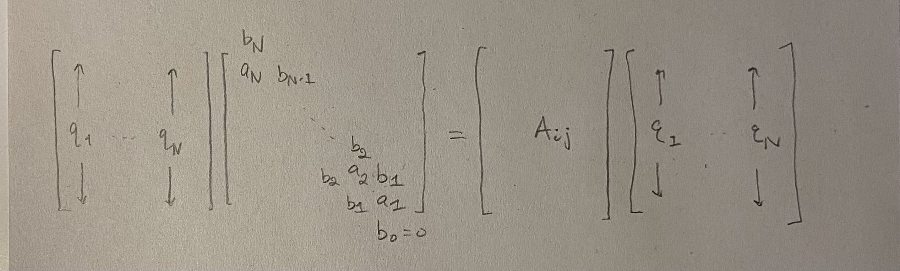
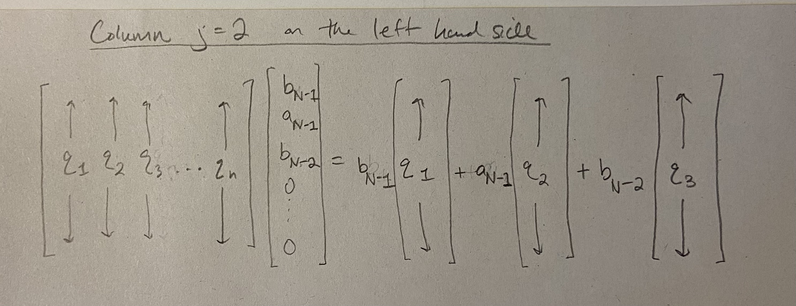

:::{.hidden}
$$
\newcommand{\R}{\mathbb{R}}
\newcommand{\N}{\mathbb{N}}
\newcommand{\Z}{\mathbb{Z}}
\newcommand{\Q}{\mathbb{Q}}
\newcommand{\C}{\mathbb{C}}
\newcommand{\eps}{\varepsilon}
\DeclareMathOperator{\Tr}{Tr}
\def\*#1{\mathbf{#1}}
$$
:::

### Introduction {#sec-Intro}

These notes are primarily based
on 
@Dimitriu2018 and
Section 4.5 in @Anderson2010, which presents the former
paper.
Sections 13 and 14 in
@Kemp2022 also proved critical for understanding 
the change of variables formulas.  

### Notation

$Z$ refers to a constant whose value makes the associated term a probability
density function or measure.
We consider random objects in some ambient probability space
$(\Omega, \mathcal{F}, P)$. 

$\mathcal{N}(\mu, \sigma)$ is the Gaussian distribution 
on $\mathbb R$ with mean $\mu \in \mathbb R$ and variance 
$\sigma > 0$.

The entry in the $i$th row and $j$th column of a matrix 
$A$ is denoted $A_{ij}$. 

Let $\R_+ = (0,\infty)$.

Let $O(N) = \{O \in \mathbb R^{N \times N}: OO^T = I_N \}$.
We define 
$$
O(N)^+ = \{ O \in O(N): O_{1,i} > 0 \text{ for all } i=1, \cdots, N \}.
$$
Similarly, we have
$$
O(N)_+ = \{ O \in O(N): \text{first nonzero entry in each column of $O$ is positive} \}.
$$
Let $H_N^{(1)}$ denote the set of all
$N \times N$ real symmetric matrices.

Let $T_N^{(1)}$ denote the tridiagonal matrices with real entries of size $N \times N$. 
Let $\mathcal{T}_N$ denote the subset of tridiagonal matrices satisfying positivity on the off-diagonal. That is,
if $(a_N, \cdots, a_1)$ and $(b_{N-1}, \cdots, b_1)$ characterize $T \in \mathcal{T}_N$, then 
$b_i > 0$ for all $i$. 
We denote $k$ dimensional Lebesgue measure on $\R^{k}$ by $\mathcal{L}_{k}$.
But if the dummy variable of integration is, say, $u$, then we would also
write $\int du$ for integration with respect to Lebesgue measure, and the dimension
can be read off from the context.

We define $\Delta_N^c = \{x_1 > x_2 > \cdots > x_N\} \subset \R^N$.
We let 
$$S^{N-1} = \{ x \in \R^N: \lVert x \rVert = 1 \},$$ 
and 
$$S_+^{N-1} = \{ x \in S^{N-1}: x_i > 0 \text{ for } i = 1, \cdots, N\}.$$

If we write $D \in \Delta_N^c$, this means that $D$ is an $N \times N$ 
diagonal matrix with diagonal entries forming an element of $\Delta_N^c$.
In this way, we identify $d \in \Delta_N^c$ with a diagonal matrix $D$.

### The $\beta$ Ensembles

The $\beta$ ensembles allow for presenting 
different matrix models all at once. The case $\beta =1$ corresponds
to the Gaussian Orthogonal Ensemble. The case $\beta = 2$ corresponds
to the Gaussian Unitary Ensemble. Interestingly, 
there is a matrix model, the so called tridiagonal matrix model, 
which corresponds to any $\beta$. Is this useful for 
physics models where $\beta \to \infty$? The author of this handout is unsure.

:::{#def-statsNpartgas}

## Statistics of $N$ particle gas, $\beta$-ensemble, $P_{V,\beta}^N$

Let $\lambda = (\lambda_1, \cdots, \lambda_N)$ be $N$ real-valued random variables. 
We define $P_{V,\beta}^N$ as the probability measure on $\mathbb R^N$ whose
density is proportional to
$$
| \Delta(\lambda) |^\beta \exp \left( -N \sum_{i=1}^N V(\lambda_i) \right) = 
\exp \left( \beta \sum_{1 \le i < j \le N} \log |\lambda_j - \lambda_i| -N \sum_{i=1}^N V(\lambda_i) \right),
$$
where the above equality holds when the $\lambda_i$ are all distinct. 
In the above, the parameter $\beta$ is a real number greater than 0, 
the function $V: \mathbb R \to \mathbb R$ satisfies continuity and logarithmic growth
at infinity:
for some $\beta' \ge \beta$ where $\beta' > 1$, we have 
$$
\liminf_{|x| \to \infty} \frac{V(x)}{\beta' \log|x|} > 1. 
$$
We will discuss how integrability of the 
density function depends on this condition.
:::

:::{#prp-logarithmic-decay}

## Logarithmic growth

Suppose $V: \R \to \R$ is continuous, 
$\beta > 0$, $\beta' > 1$, $\beta' \ge \beta$, and
$\liminf_{|x| \to \infty} \frac{V(x)}{\beta' \log|x|} > 1.$
Then $f(\cdot): \R^N \to \R$ defined by
$$
\lambda \mapsto \begin{cases}
\exp \left( \beta \sum_{1 \le i < j \le N} \log |\lambda_j - \lambda_i| -N \sum_{i=1}^N V(\lambda_i) \right) & \text{if the }\lambda_i \text{ are distinct}\\
0 & \text{else}
\end{cases}
$$ 
is Borel measurable and satisfies $\int_{\R^N} d\mathcal{L}_{N}(\lambda) f(\lambda) < \infty$.
:::

::: {.proof}
In this proof we will write $d\lambda = d\mathcal{L}_{N}(\lambda)$ to make
the typing easier. Borel measurability follows from the fact that 
$f$ is continuous. Note that $f(\lambda) = | \Delta(\lambda) |^\beta \exp \left( -N \sum_{i=1}^N V(\lambda_i) \right)$
regardless of whether the $\lambda_i$ are distinct or not, and in this way $f$ can be seen to 
be composed of several continuous functions. Recall that $\text{add}: \R^2 \to \R$, $(x_1, x_2) \mapsto x_1 + x_2$ 
is continuous. Recall also that $|\Delta(\lambda) |^\beta = \prod_{1 \le i < j \le N} |\lambda_i - \lambda_j|^\beta$.

Next we study integrability.

In the following paragraph, we prove that
there exists some $M > 0$ such that
$$V(x) > \beta' \log |x| \hspace{0.5cm}\text{ for all } |x| \ge M.$$ 
Indeed, $1$ is strictly less
than the limit infimum of $\frac{V(x)}{\beta' \log |x|}$
as $|x| \to \infty$, which means that there
is some $M > 0$ so that $\frac{V(x)}{\beta' \log |x|} > 1$
for all $|x| \ge M$. Hence, $V(x) > \beta' \log |x|$ for 
$|x| \ge M$.

Let us split up the integral based on the $M$ we found above:

$$
\int_{\R^N} d\lambda f(\lambda) = \int_{\R^N \setminus [-M,M]^N} d\lambda f(\lambda) 
+ \int_{[-M,M]^N} d\lambda f(\lambda).
$$
In the rest of this paragraph, we argue that the integral over the region $[-M,M]^N$ is finite. 
Note that $f$ is continuous, and in particular continuous on $[-M,M]^N$. Since $[M, M]^N$
is compact and continuous functions map compact domains to compact images,
we see that $f([-M,M]^N)$ is bounded in $\R$. Together with 
the bounded $N-$dimensional Lebesgue measure of $[-M,M]^N$, we see that 
$\int_{[-M,M]^N} d\lambda f(\lambda) < \infty$.

Next, 
$$
\int_{\R^N \setminus [-M,M]^N} d\lambda f(\lambda) = \int_{\R^N \setminus [-M,M]^N} d \lambda \exp \left( \beta \sum_{1 \le i < j \le N} \log |\lambda_j - \lambda_i| -N \sum_{i=1}^N V(\lambda_i) \right).
$$
The integrand on the right hand side is
defined $\mathcal{L}_{N}$ almost everywhere,
and the section titled "Maps defined almost everywhere"
on page 137 of @Amann tells us how to make sense of this
integral. In particular, we could define the right hand side
as the integral
$$
\int_{\R^N \setminus (I \cup [-M,M]^N)} d \lambda \exp \left( \beta \sum_{1 \le i < j \le N} \log |\lambda_j - \lambda_i| -N \sum_{i=1}^N V(\lambda_i) \right)
$$
where $I = \{ x \in \R^N: x_i = x_j \text{ for some } i \ne j \}$ is a finite collection of
$1, 2, \cdots, N-1$ dimensional subspaces of $\R^N$. 
For example, the constraint $x_1 = x_2$ in the ambient space $\R^3$ is
a plane which projects down onto the line $y = x$.

Next, $V(x) > \beta' \log |x|$ for $|x| \ge M$ implies
$$
\int_{\R^N \setminus [-M,M]^N} d\lambda f(\lambda) \le \int_{\R^N \setminus [-M,M]^N} d \lambda \exp \left( \beta \sum_{1 \le i < j \le N} \log |\lambda_j - \lambda_i| -N \sum_{i=1}^N \beta' \log |\lambda_i| \right).
$$
Next, the inequality 
$$
\log|x-y| \le \log(|x| + 1) + \log (|y| + 1)
$$
implies that
$$
\sum_{1 \le i < j \le N} \log |\lambda_j - \lambda_i| \le 
\sum_{1 \le i < j \le N} \log (|\lambda_j |+1) + \log( |\lambda_i| + 1).
$$
There appear
$N-1$ terms of the form $\log(|\lambda_1| + 1)$ in the right hand summation above.
A little bit more thought shows that this is also true for $\log(|\lambda_i| + 1)$
where $i = 1, 2, \cdots, N$.
Hence, 
$$
\sum_{1 \le i < j \le N} \log (|\lambda_j |+1) + \log( |\lambda_i| + 1) 
= (N-1) \sum_{i=1}^N \log( |\lambda_i| + 1).
$$
We arrive at
$$
\int_{\R^N \setminus [-M,M]^N} d\lambda f(\lambda) \le \int_{\R^N \setminus [-M,M]^N} d \lambda \exp \left( \beta (N-1) \sum_{i=1}^N \log( |\lambda_i| + 1) -N \sum_{i=1}^N \beta' \log |\lambda_i| \right).
$$
Next, 
\begin{align*}
\exp \left( \beta (N-1) \sum_{i=1}^N \log( |\lambda_i| + 1) -N \sum_{i=1}^N \beta' \log |\lambda_i| \right) =\\
\exp \left( \beta (N-1) \sum_{i=1}^N \log(|\lambda_i| + 1) -\beta'(N-1) \sum_{i=1}^N \log |\lambda_i| - \beta' \sum_{i=1}^N \log |\lambda_i| \right) = \\
\exp \left( \beta \cdot (N-1) \left( \sum_{i=1}^N \log(|\lambda_i| + 1) -\frac{\beta'}{\beta} \sum_{i=1}^N \log |\lambda_i| \right) - \beta' \sum_{i=1}^N \log |\lambda_i| \right) = \\
\exp \left( \beta (N-1) \sum_{i=1}^N \log( \frac{ |\lambda_i| + 1 }{|\lambda_i|^{\frac{\beta'}{\beta}}}) - \sum_{i=1}^N \beta' \log |\lambda_i| \right) =\\
\prod_{i=1}^N \exp \left( \beta (N-1)  \log( \frac{ |\lambda_i| + 1 }{|\lambda_i|^{\frac{\beta'}{\beta}}}) -  \beta' \log |\lambda_i| \right) =\\
\prod_{i=1}^N \left( \frac{|\lambda_i| + 1}{|\lambda_i|^{\frac{\beta'}{\beta}}} \right)^{\beta (N-1)} \cdot \frac{1}{|\lambda_i|^{\beta'}}.
\end{align*}
From Analysis 1 and the fact that $\beta' \ge \beta$, we have that 
$$
\frac{|x| + 1}{|x|^{\frac{\beta'}{\beta}}} = O(1) \text{ as }|x| \to \infty.
$$
Taking a function which is $O(1)$ to the $\beta \cdot (N-1)$ power
remains $O(1)$ as $|x| \to \infty$. Hence, there exists some $C > 0$ and 
$M' > 0$ such that for all $|x| \ge M'$, we have
$$
\left( \frac{|x| + 1}{|x|^{\frac{\beta'}{\beta}}} \right)^{\beta \cdot (N-1)} \le C.
$$
Let us assume without loss of generality (by making $M$ larger in the previous analysis) that
$M' \le M$. Hence, 
$$
\int_{\R^N \setminus [-M,M]^N} d\lambda f(\lambda) \le
\int_{\R^N \setminus [-M,M]^N} d\lambda \prod_{i=1}^N C \cdot \frac{1}{|\lambda_i|^{\beta'}}.
$$
Since $\beta' > 1$ and $\frac{1}{|x|^{\beta'}}$ is integrable on 
$\R \setminus (-\epsilon, \epsilon)$ for any $\epsilon > 0$, 
we conclude that
$$
\int_{\R^N \setminus [-M,M]^N} d\lambda f(\lambda)  < \infty.
$$

:::

:::{#exm-GOE}
## GOE

Let $X_N$ be a GOE(N) matrix, as defined in
@Anderson2010.\footnote{Or if we take $Y_N$ as a 
GOE(N) matrix according
to the convention in @Kemp2022, then we have 
$\sqrt{2N} \cdot Y_N = X_N$.} 
By definition, we have that 
$X_N$ is a symmetric real matrix,
and the entries are all independent 
(apart from the entries below the diagonal)
and distributed in the following way.
\begin{align*}
(X_N)_{i,i} &\sim \mathcal{N}(0,2) && \text{(on the diagonal)}\\
(X_N)_{i,j} &\sim \mathcal{N}(0,1) && \text{(above the diagonal)}
\end{align*}
Consider the $N$ random unordered eigenvalues of $X_N$:
$$(\lambda_1, \cdots, \lambda_N).$$
Their joint distribution has density
$$
Z |\Delta(\lambda)| e^{-\sum_{i=1}^N \frac{\lambda_i^2}{4}}. 
$$
It follows that $\frac{1}{\sqrt{N}}(\lambda_1, \cdots, \lambda_N)$
has the $\beta = 1$ ensemble distribution: 
$$
P(\frac{1}{\sqrt{N}}(\lambda_1, \cdots, \lambda_N) \in A) = \int_A dP_{\frac{x^2}{4}, 1}^N.
$$
with $V(x) = \frac{\beta x^2}{4}$ in this case.
:::

:::{#exm-GUE}
## GUE

Let $X_N$ be a GUE(N) matrix, so that $X$ is 
an $N \times N$ complex Hermitian matrix. According 
to the definition in @Anderson2010,\footnote{If $Y_N$
is a GUE(N) matrix according to @Kemp2022,
then $Y_N = \frac{1}{\sqrt{N}} X_N$.}
the entries of 
$X_N$ are distributed as follows. 
\begin{align*}
(X_N)_{i,i} &\sim \mathcal{N}(0,1) && \text{(on diagonal)}\\
(X_N)_{i,j} & \sim \mathcal{N}(0, 1/2) + i \mathcal{N}(0, 1/2) && \text{(above diagonal)}
\end{align*}
The joint eigenvalue density is
$$
Z |\Delta(\lambda)|^2 e^{-\sum_{i=1}^N \frac{2 \lambda_i^2}{4}}.
$$
Thus, the law of the rescaled eigenvalues 
$\frac{1}{\sqrt{N}}(\lambda_1, \cdots, \lambda_N)$ is
$P_{V, \beta}^N$ where $\beta = 2$ and $V(x) = \frac{\beta x^2}{4}$. 
:::

### Tridiagonal Matrix Representation of $\beta$ ensembles

#### Preliminaries

:::{#def-trigiagonalmatrix}

## Tridiagonal matrix and its parametrization

A symmetric matrix $X$ is tridiagonal if $X_{ij} = 0$ whenever $|i - j| > 1$.
Vectors $a = (a_1, \cdots, a_N)$ and $b = (b_1, \cdots, b_{N-1})$
parametrize $X$ by setting $X_{ii} = a_{N-i + 1}$ 
and $X_{i, i+1} = b_{N-i}$. That is, we have a map $T$ given by
$$
\R^{N} \times \R^{N-1} \ni (a,b) \mapsto T(a,b) = \begin{bmatrix}
a_N & b_{N-1} & &  &  \\
b_{N-1} & a_{N-1} & b_{N-2} &  & \\
& b_{N-2} & & & \\
& & \ddots& \ddots & \\
& & b_2& a_2&b_1 \\
& & & b_1& a_1
\end{bmatrix}.
$$
Whenever we refer to a tridiagonal matrix, it will always be symmetric.
We call $T_N^{(1)}$ the set of all tridiagonal (symmetric) matrices. 
We call $\mathcal{T}_N$ the set of all tridiagonal matrices with $b_i > 0$ 
for all $i$.
:::

\begin{remark}
A restriction of $T$ defines a bijection between 
$(a,b) \in \mathbb R^N \times \mathbb R_+^{N-1}$ and $\mathcal{T}_N$.
\end{remark}

:::{#def-Psi}

## $\Psi$ and $\Psi^{-1}$

Let $a \in \R^N$, $b \in \R_+^{N-1}$, 
$u \in S_+^{N-1}$, and $d \in \Delta_N^c$.
The equation
$$
T(a,b) = ODO^T
$$
where $O \in O(N)^+$ has first row $u$ and $D = \text{diag}(d)$
defines a bijection $\Psi: \Delta_N^c \times S_+^{N-1} \to \R^N \times \R^{N-1}_+$
given by $\Psi(d,u) = (a,b)$. 
The inverse map $\Psi^{-1}: \R^N \times \R^{N-1}_+ \to  \Delta_N^c \times S_+^{N-1}$ 
is given by $\Psi^{-1}(a,b) = (d,u)$.

In particular, given that $\Psi(d,u) = (a,b)$, then there is a unique matrix
$D$ with diagonal $d$ and a unique matrix $O \in O(N)^+$ with first row $u$ 
such that $T(a,b) = ODO^T$. The same conclusion holds if we are given 
that $(d,u) = \Psi^{-1}(a,b)$.

See Corollary @cor-PsiInverse and Corollary @cor-Psi
for statements and proofs justifying the definition 
of $\Psi$ and $\Psi^{-1}$.
:::

:::{#lem-LemmaJacobian}

## Jacobian Lemma

The map $\Psi$ given by
$$
\Delta_N^c \times S_+^{N-1} 
\ni (d, v) \mapsto (a, b) \in 
\mathbb {R}^N \times \mathbb {R}_+^{N-1}
$$
has Jacobian $J: \Delta_N^c \times S_+^{N-1} \to [0,\infty]$ proportional to
$$
\frac{\Delta(d)}{\prod_{i=1}^{N-1} b_i^{i-1}}.
$$
:::

::: {.proof}
See Section @sec-Jacobian. 
:::

#### Dimitriu-Edelman Theorem

In one sentence, this section shows that
placing Gaussian variables on 
the diagonal, and $\chi$ random variables
on the off-diagonal, then scaling by $\sqrt{\beta}$, results
in a random matrix whose (rescaled) eigenvalues have 
law corresponding to $P_{\frac{\beta x^2}{4}, \beta}^N$ for 
general $\beta$.

:::{#def-chi}

## $\chi_t$ distribution with $t$ degrees of freedom

The probability measure on $\mathbb R$ with density
$$
f_t(x) = 1_{\mathbb R_+}(x) \cdot C \cdot x^{t-1} e^{-\frac{x^2}{2}} 
$$

where $C = \frac{2^{1-t/2}}{\Gamma(t/2)}$ is
called the $\chi$ distribution with $t >0$ degrees of 
freedom. 
:::

Note that, if $X = (X_1, \cdots, X_n) \in \mathbb R^n$ is a Gaussian random vector,
then $\lVert X \rVert_2 = \sqrt{\sum_{i=1}^N X_i^2}$ has the distribution $\chi_n$, which
motivates the $t=n$ degrees of freedom in the name.

:::{#lem-chidensity}

Let $t, \beta > 0$ be given. If $X \sim \chi_t$, then $\frac{1}{\sqrt{\beta}} X$ has probability
density function proportional to 
$$
x^{t-1} e^{-\beta \frac{x^2}{2}}.
$$
:::

::: {.proof}
Let $B$ be a Borel subset of $\R_+$. 
Then
\begin{align*}
P[\frac{1}{\sqrt{\beta}}X \in B] &= P[X \in \sqrt{\beta} B] \\
&= \int_{\sqrt{\beta} B} C \cdot x^{t-1} e^{-\frac{x^2}{2}}  dx \\
&= \int_{B} C \cdot (\sqrt{\beta} y)^{t-1} e^{-\beta \frac{x^2}{2}} dy \\
&= \int_B C_1 \cdot y^{t-1} e^{-\beta \frac{y^2}{2}} dy.
\end{align*}
:::

:::{#def-trimatrixrep}

## Tridiagonal Matrix Representation of $\beta$ ensemble for a fixed $\beta$

Assume $\beta > 0$ is given.
Let $\{\xi_i\}_{i=1}^\infty$ be an independent family of $\mathcal{N}(0,1)$ random variables. 
Let $\{Y_i\}_{i=1}^\infty$ be an independent family of random variables, 
not identically distributed, but with $Y_i \sim \chi_{i \beta}$ for all $i = 1, 2, \cdots$. 
Assume also that the two families $\{\xi_i\}_{i=1}^\infty$ and 
$\{Y_i\}_{i=1}^\infty$ are independent. 

Let $N$ be a given positive integer. 
Define two random vectors
$$
\* a = (a_1, \cdots, a_N): \Omega \to \R^N
$$
and
$$
\* b = (b_1, \cdots, b_{N-1}): \Omega \to \R^{N-1}
$$
with 
$a_i = \sqrt{2/\beta} \xi_i$ for $i = 1, \cdots, N$
and $b_i = \sqrt{1/\beta} Y_{i}$ for $i = 1, \cdots, N-1$.
Let $T: \R^N \times \R_+^{N-1} \to T_N^{(1)}$ be the map 
$$
\R^N \times \R_+^{N-1} \ni (a_1, \cdots, a_N,b_1, \cdots, b_{N-1}) \mapsto \begin{bmatrix}
a_N & b_{N-1} & &  &  \\
b_{N-1} & a_{N-1} & b_{N-2} &  & \\
& b_{N-2} & & & \\
& & \ddots& \ddots & \\
& & b_2& a_2& b_1 \\
& & & b_1& a_1
\end{bmatrix} = T(a,b) \in T_N^{(1)}.
$$
Then we call the sequence of random matrices
$$
T(\* a, \* b): \Omega \to T_N^{(1)}
$$
the tridiagonal matrix ensemble/model which represents the $\beta$ ensemble.

The following illustrates the distribution of the 
entries of matrix from this tridiagonal model:
$$
\frac{1}{\sqrt{\beta}}\begin{bmatrix}
\sqrt{2} \mathcal{N}(0,1) & \chi_{\beta \cdot (N-1)} &  & & & & \\
\chi_{\beta \cdot (N-1)} & \sqrt{2} \mathcal{N}(0,1) & \chi_{\beta \cdot (N-2)} & & & & \\
& \chi_{\beta \cdot (N-2)} & \sqrt{2} \mathcal{N}(0,1) & & & & \\
& & & \ddots & & & \\
& & & & \sqrt{2} \mathcal{N}(0,1) & \chi_{\beta \cdot (2)} & \\
& & & & \chi_{\beta \cdot (2)} & \sqrt{2} \mathcal{N}(0,1)  & \chi_{\beta \cdot (1)}  \\
& & & & & \chi_{\beta \cdot (1)} & \sqrt{2} \mathcal{N}(0,1) 
\end{bmatrix}.
$$
:::

\begin{remark}
The following Theorem studies the 
eigenvalues of $T(\* a, \* b): \Omega \to \mathcal{T}_N$.
In this remark we discuss
why the eigenvalues are themselves random variables.
To illustrate the idea, it is enough to consider the top eigenvalue $\lambda_1$. 
Then we view
$$
\lambda_1 := \lambda_1 \circ T(\* a, \* b) : \Omega \to \mathbb R.
$$
In order for $\lambda_1$ to be a random variable, it must be measurable.
To begin, we consider $\lambda_1$
on the right hand side
in the composition 
$\lambda_1 \circ T(\* a, \*b)$.  Here, $\lambda_1: \mathcal{T}_N \to \mathbb R$
is the map
$$
A \mapsto \text{greatest root of the polynomial } P(x) = \det(x - A): \mathbb R \to \mathbb R.
$$
That is, 
$$
A \mapsto \sup_{x \in \mathbb R} \{ \det(x - A)= 0 \}.
$$
It turns out (see page 2 of @Anderson2010)
that $\lambda_1: \mathcal{T_N} \to \mathbb R$ is continuous.
This is the idea that perturbing a matrix $A$ is a continuous, albeit, sometimes
chaotic operation for ill-conditioned matrices.
Thus, $\lambda_1(T(\* a, \*b))$ is a composition of a continuous map 
and a measurable map.
Recall briefly the gist of why $\text{continuous} \circ \text{measurable}$ is 
again measurable.
Let $f: \Omega \to \text{Borel}$ be measurable 
and $g: \text{Borel} \to \text{Borel}$ continuous
on suitable domains. WTS that $g \circ f$ is measurable.
Open sets generate the Borel sets in the codomain of $g$.
So it is enough to check preimages of open sets.

So $\lambda_1(T(\* a, \* b))$ is measurable on $\Omega$.
So we write that $\lambda_1(T(\* a, \* b))$ is a random variable, and for short 
we say that $\lambda_1$ is a random variable.
\end{remark}

:::{#thm-Dimitriu-Edelman}

## Dimitriu-Edelman

Fix $\beta > 0$ and suppose $T(\* a, \* b): \Omega \to \mathcal{T}_N$
is a matrix from the tridiagonal matrix model, as above.
If $(\lambda_1, \cdots, \lambda_N)$ denotes the random 
eigenvalues of $T(\* a, \* b)$, then the joint law of these eigenvalues
has density
$$
Z |\Delta(\lambda)|^\beta e^{-\frac{\beta}{4} \sum_{i=1}^N \lambda_i^2}.
$$
In particular, 
$\frac{1}{\sqrt{N}} \lambda = \frac{1}{\sqrt{N}}(\lambda_1, \cdots, \lambda_N)$ has joint law
of the $\beta$ ensemble:
$$
P(\frac{1}{\sqrt{N}} \lambda \in A) = 
\int_A Z |\Delta(\lambda)|^\beta e^{-N \frac{\beta}{4} \sum_{i=1}^N \lambda_i^2} d\lambda
= \int_A dP_{V, \beta}^N(\lambda) 
$$
for $V(x) = \frac{\beta x^2}{4},$ and $A$ a Borel subset of $\mathbb R^N$. 
:::

::: {.proof}
We want to show that 
$$
P(\lambda(T(\* a, \* b) ) \in B) = Z \int_B 
d\mathcal{L}_{N}(\lambda) |\Delta(\lambda)|^\beta e^{-\frac{\beta}{4} \sum_{i=1}^N \lambda_i^2}
$$
for any $B \in \mathcal{B}(\Delta_N^c)$. Observe that
\begin{align*}
P(\lambda(T(\* a, \* b) ) \in B) &= 
\int_{\Omega} dP(\omega) \, 1_{\{\omega': \lambda(T(\* a, \* b)(\omega') ) \in B\}}(\omega)\\
&= \int_{\R^N \times \R_+^{N-1}} d(P_{\* a} \otimes P_{\* b})(a,b) 1_{\{(a',b'): \lambda(T(a',b') ) \in B\}}(a,b)
\end{align*}
Let us abbreviate $1_{\{(a',b'): \lambda(T(a',b') ) \in B\}}(a,b) = I(a,b)$.
Then using the formula for the density of the law $P_{\* a} \otimes P_{\* b}$, we obtain
\begin{align*}
P(\lambda(T(\* a, \* b) ) \in B) &=
\int_{\R^N \times \R_+^{N-1}} d\mathcal{L}_{2N-1}(a,b) I(a,b) e^{-\beta/4 \sum_{i=1}^N a_i^2-\beta/2 \sum_{i=1}^{N-1} b_i^2}
\prod_{i=1}^{N-1} b_i^{i\beta - 1}.
\end{align*}
Then making a change of variable $(a,b) = \Psi(d,u)$, we obtain
\begin{align*}
P(\lambda(T(\* a, \* b) ) \in B) &=
\int_{\Delta_N^c \times S_+^{N-1}} d\mathcal{L}_N(d) d\sigma(u) I(\Psi(d,u)) J(d,u) e^{-\beta/4 \sum_{i=1}^N a_i^2-\beta/2 \sum_{i=1}^{N-1} b_i^2}
\prod_{i=1}^{N-1} b_i^{i\beta - 1}.
\end{align*}

:::{#lem-fasnfkj}
For $(d,u) \in \Delta_N^c \times S_+^{N-1}$, we have
$I(\Psi(d,u)) = 1_{B \times S_+^{N-1}}(d,u)$.
:::

::: {.proof}
Fix $(d,u) \in \Delta_N^c \times S_+^{N-1}$.  
Let $(a,b) = \Psi(d,u)$. Then 
by @cor-Psi, there exists a unique matrix $Q \in O(N)^+$ with first row $u$
and $T(a,b) = QDQ^T$ where $D = \text{diag}(d)$. 

Consider the 
case that $d \in B$. 
Observe that $\lambda(T(a,b)) = d$ because 
$T(a,b)$ has eigenvalue matrix $D$. Thus, 
$d \in B$ implies $\lambda(T(a,b)) \in B$. 
Then 
\begin{align*}
I(\Psi(d,u)) &= I(a,b) \\
&= 1_{\{(a',b'): \lambda(T(a',b') ) \in B\}}(a,b) \\
&= 1 = 1_{B \times S_+^{N-1}}(d,u).
\end{align*}

If $d \not \in B$, then
$\lambda(T(a,b)) \not \in B$, so 
\begin{align*}
I(\Psi(d,u)) &= I(a,b) \\
&= 1_{\{(a',b'): \lambda(T(a',b') ) \in B\}}(a,b) \\
&= 0 = 1_{B \times S_+^{N-1}}(d,u).
\end{align*}
This concludes the proof.
:::

Another consequence of the implication that $(a,b) = \Psi(d,u)$ results in
a unique matrix $Q \in O(N)^+$ with first row $u$
and $T(a,b) = QDQ^T$ where $D = \text{diag}(d)$
is the following.
\begin{align*}
\sum_{i=1}^{N} a_i^2 + 2 \sum_{i=1}^{N-1} b_i^2 &= \Tr (T(a,b)^2) \\
&= \Tr (QDQ^TQDQ^T) \\
&= \Tr (D^2) = \sum_{i=1}^N d_i^2.
\end{align*}
Hence, we obtain
\begin{align*}
P(\lambda(T(\* a, \* b) ) \in B) &=
\int_{\Delta_N^c \times S_+^{N-1}} d\mathcal{L}_N(d) d\sigma(u) 1_{B \times S_+^{N-1}}(d,u) J(d,u) e^{-\beta/4 \sum_{i=1}^N d_i^2}
\prod_{i=1}^{N-1} b_i^{i\beta - 1}.
\end{align*}

Since 
$$J(d,u) \propto \frac{\Delta(d)}{\prod_{i=1}^{N-1} b_i^{i-1}}$$
by Lemma @lem-LemmaJacobian,
we notice that 
\begin{align*}
J(d,u)\prod_{i=1}^{N-1} b_i^{i\beta - 1} &\propto \frac{\Delta(d)}{\prod_{i=1}^{N-1} b_i^{i-1}}
\prod_{i=1}^{N-1} b_i^{i\beta - 1} \\
&= \Delta(d) \prod_{i=1}^{N-1} \frac{b_i^{i \beta - 1}}{b_i^{i-1}} \\
&= \Delta(d) \prod_{i=1}^{N-1} b_i^{i(\beta-1)} \\
&= \Delta(d) \left( \prod_{i=1}^{N-1} b_i^i \right)^{(\beta - 1)}.\\
\end{align*}
Lemma 4.5.37 in @Anderson2010, which we do not prove in 
these notes, says that
$$
\Delta(d) = \frac{\prod_{i=1}^{N-1} b_i^i}{\prod_{i=1}^N u_i^i}.
$$
Together with the fact that $\Delta(d) \ne 0$ for $d \in \Delta_N^c$, we obtain
\begin{align*}
J(d,u)\prod_{i=1}^{N-1} b_i^{i\beta - 1} &\propto \Delta(d) \left( \prod_{i=1}^{N-1} b_i^i \right)^{(\beta - 1)}\\
&= \Delta(d)^{\beta + (1 - \beta)}  \left( \prod_{i=1}^{N-1} b_i^i \right)^{(\beta - 1)} \\
&= \Delta(d)^{\beta} \left( \frac{\prod_{i=1}^{N-1} b_i^i}{\prod_{i=1}^N u_i^i} \right)^{1 - \beta} \left( \prod_{i=1}^{N-1} b_i^i \right)^{(\beta - 1)} \\
&= \Delta(d)^{\beta} \left( \prod_{i=1}^{N} u_i^i \right)^{(\beta - 1)}.
\end{align*}

With this we obtain

\begin{align*}
P(\lambda(T(\* a, \* b) ) \in B) &=
\int_{\Delta_N^c \times S_+^{N-1}} d\mathcal{L}_N(d) d\sigma(u) 1_{B \times S_+^{N-1}}(d,u) e^{-\beta/4 \sum_{i=1}^N d_i^2}
\Delta(d)^{\beta} \left( \prod_{i=1}^{N} u_i^i \right)^{(\beta - 1)} \\
&= \int_{S_+^{N-1}} d\sigma(u) \left( \prod_{i=1}^{N} u_i^i \right)^{(\beta - 1)} \int_{B} d\mathcal{L}_N(d) e^{-\beta/4 \sum_{i=1}^N d_i^2}
\Delta(d)^{\beta},
\end{align*}
which is what we needed to show, because 
$\int_{S_+^{N-1}} d\sigma(u) \left( \prod_{i=1}^{N} u_i^i \right)^{(\beta - 1)}$ is a constant.
:::

### Tridiagonal Matrix Details

Let $H_N^{(1)}$ denote the set of all
$N \times N$ real symmetric matrices.
Let $O(N) = \{O \in \mathbb R^{N \times N}: OO^T = I_N \}$.

:::{#thm-7.2.1}

## Theorem 7.2.1 in @Parlett

Let $A$ be an arbitrary real symmetric $N \times N$ matrix.
Let $T_+ = T(a,b) \in \mathcal{T}_N$ be a tridiagonal matrix parametrized by $a \in \mathbb R^N$ and 
$b \in \mathbb R_+^{N-1}$,  where $b_i >0$ for all $i = 1, \cdots, N-1$.
Let $Q^TAQ = T_+$ with $Q$ orthogonal.
Then $T_+$ and $Q = (\* q_1, \* q_2, \cdots, \* q_N)$ (the columns of $Q$)
are uniquely determined by $A$ and $\* q_1$. 
:::

::: {.proof}
The hypothesis can be written as
$$
QT_+ = AQ
$$
by orthogonality of $O$.
Define $b_N = 0$ and $b_0 = 0$, as in figure @fig-QTAQ.

{#fig-QTAQ width=80%}

The $j$th column on the left hand side, as an element 
in $\R^{N \times 1}$, is

$$
b_{N-j+1} \* q_{j-1} + a_{N-j+1} \* q_{j} + b_{N-j} \* q_{j+1},
$$

which can be seen in figure @fig-LHSjthcolumn. 
\begin{figure}[htbp]
\begin{center}
\includegraphics[width=\textwidth]{LHSjthcolumn.jpeg}
\caption{Left hand side of jth column in the case $j=2$.}
\label{LHSjthcolumn}
\end{center}
\end{figure}

{width=80% #fig-LHSjthcolumn}

Setting this equal to the $j$th column on the right hand side, we obtain 
$$
A \* q_j = b_{N-j+1} \* q_{j-1} + a_{N-j+1} \* q_{j} + b_{N-j} \* q_{j+1},
$$

or written in a recursive style: 

$$
b_{N-j} \* q_{j+1} =  A \* q_j - b_{N-j+1} \* q_{j-1} - a_{N-j+1} \* q_{j} \equiv \* r_j
$$

for each $j = 1, \cdots, N$.
Observe that $\* q_0$ is undefined because $b_N = 0$
and $\* q_{N+1}$ is undefined because $b_0 = 0$.
Also, $\* r_N = 0$ because $b_{N-N} \* q_{N+1} = 0 \cdot \* q_{N+1}  = 0$. 
Written in tabular form, we have the equations

$$\left(
\begin{array}{cccc}
\* (j=1) & \* q_2 b_{N-1} =  & A \*q_1 - \* q_1 a_N  & = \* r_1 \\
(j=2)& \* q_3 b_{N-2} =  & A\* q_2 - \* q_2 a_{N-1} - \* q_1 b_{N-1}  & = \* r_2\\
\vdots&   &   &\\
(j=N-1) & \* q_N b_{1} = & A \* q_{N-1} - \* q_{N-1}a_{2} - \* q_{N-2}b_{2}& = \* r_{N-1} \\
(j=N)& 0=  & A \* q_N - \* q_N a_1 - \* q_{N-1}b_{1} & = \* r_N \\
\end{array}
\right)$${#eq-constraint1}

Next we will exploit the fact that $\* q_i^T \* q_j = \delta_{ij}$ for orthogonal matrices,
which means also that $\lVert \* q_i \rVert^2 = 1$, which implies that $\lVert \* q_i \rVert = 1$. 
Left multiplying the $j$th equation by $\* q_j^T$, we obtain

$$
\left(
\begin{array}{ccc}
\* (j=1) & 0 =  & \*q_1^T A \*q_1 -  a_N  \\
(j=2)& 0 =  & \* q_2^T A\* q_2 - a_{N-1}\\
\vdots&   &  \\
(j=N-1) &  0 = & \* q_{N-1}^T A \* q_{N-1} - a_{2} \\
(j=N)& 0=  & \* q_N^TA \* q_N - a_1  \\
\end{array}
\right).
$${#eq-constraint2}

Going down a different road by taking the norm of the $j$th equation yields

$$\left(
\begin{array}{cccc}
\* (j=1) & b_{N-1} =  & \lVert \* q_2 b_{N-1} \rVert   & = \lVert \* r_1 \rVert \\
(j=2)&  b_{N-2} =  & \lVert \* q_3 b_{N-2} \rVert  & =  \lVert  \* r_2 \rVert\\
\vdots&   &   &\\
(j=N-1) & b_{1} = & \lVert \* q_N b_{1} \rVert & = \lVert \* r_{N-1} \rVert \\
(j=N)& 0=  & 0  & = \lVert \* r_N  \rVert \\
\end{array}
\right).
$${#eq-constraint3}

Yet another perspective, using that $b_i > 0$ for $i = 1, \cdots, N-1$, yields
\begin{equation}
\left(
\begin{array}{ccc}
\* (j=1) & \* q_2 & = \* r_1 / b_{N-1} \\
(j=2)& \* q_3  & = \* r_2 / b_{N-2} \\
\vdots&   &  \\
(j=N-1) & \* q_N & = \* r_{N-1} / b_{1} \\
\end{array}
\right).
\end{equation}

Now suppose we are given inputs $A$ and $\*q_1$.
Our task is to determine 
$$
T_+ = \begin{bmatrix}
a_N & b_{N-1} & &  &  \\
b_{N-1} & a_{N-1} & b_{N-2} &  & \\
& b_{N-2} & & & \\
& & \ddots& \ddots & \\
& & b_2& a_2&b_1 \\
& & & b_1& a_1
\end{bmatrix}
$$ 

and $(\* q_2, \cdots, \*q_N)$ 
based on the above constraints. 

Let's begin with $j=1$. 
Notice that $a_N$ can be solved for based on the 
inputs using the 2nd set of constraints, and we get $a_N = \* q_1^T A \* q_1$. 
In turn we can solve for $\* r_1$ using the first set of constraints. 
Then using the third set of constraints, we obtain $b_{N-1}$. 
Then using the fourth set of constraints, we obtain $\* q_2$.
Then the loop starts over again.
We conclude that all the unknowns were obtained 
only with the initial inputs $A$ and $\* q_1$. 
Notice also that we found unique solutions $Q$ and $T_+$ when given 
$A$ and $\* q_1$. This was a result of the linearity of the 
constraints we used. This is important to notice in order to conclude that
$A$ and $\* q_1$ uniquely determine $Q$ and $T_+$.
:::

In the end, we want to follow
the proof of the joint law of eigenvalues of a tridiagonal
matrix model presented in @Anderson2010, 
so let's get a bit organized using the following table:
\[
\left(
\begin{array}{ccc}
\text{@Parlett} &   \text{@Dimitriu2018} &  \text{@Anderson2010} \\
Q^T A Q = T_+ & U \Lambda U^T = T_+  & UDU^T = T_+   \\
\* q_1 \text{ first col of } Q & q \text{ first row of } U  &  \* v \text{ first row of } U
\end{array}
\right).
\]
In the second column, $U \Lambda U^T$ denotes a unique 
eigendecomposition of $T_+$ where the the signs of the first row
of $U$ are non-negative and the eigenvalues are ordered 
$\lambda_1 < \cdots < \lambda_N$ on the diagonal of $\Lambda$. 
This increasing order on the diagonal in @Dimitriu2018 is not followed in 
@Anderson2010, which uses a decreasing order on the diagonal, which 
can be seen in the definition of $\Delta_N^c = \{(x_1, \cdots, x_N) \in \R^N: x_1 > \cdots > x_N\}$.
Note that the eigenvalues are distinct for $T_+ \in \mathcal{T}_N$ by Lemma 4.5.36 
in @Anderson2010.
Furthermore, we've already adapted the proof of Theorem 7.2.1 in @Parlett
to match the parametrization of tridiagonal matrices used in 
@Dimitriu2018 and @Anderson2010. 

To see how (@thm-7.2.1) defines a function, we
recall:

:::{#def-function}

## Function

Suppose $A$ and $B$ are sets. A function
$f$ from $A$ to $B$ is a subset $f \subset A \times B$, 
denoted $f: A \to B$,
satisfying the property that for each $a \in A$, the subset $f$ 
contains exactly one ordered pair of the form $(a,b)$.
The statement $(a,b) \in f$ is abbreviated $f(a) = b$.
:::

:::{#cor-map-from-parlett-thm}
The subset 
$$
\mathcal{S} = \{ (A, \* q_1, T_+, Q) \in H_N^{(1)} \times S^{N-1} \times \mathcal{T}_N \times O(N) \mid
Q^T A Q = T_+ \text{ and } \* q_1 \text{ is the first column of } Q\}
$$
of $H_N^{(1)} \times S^{N-1} \times \mathcal{T}_N \times O(N)$
defines a function 
$$\mathcal{S}: H_N^{(1)} \times S^{N-1} \to \mathcal{T}_N \times O(N)$$
satisfying, for $A \in H_N^{(1)}$ and $q \in S^{N-1}$ the equation
$$
\mathcal{S}_2(A,q)^T A \mathcal{S}_2(A,q) = \mathcal{S}_1(A,q).
$$
where $\mathcal{S}_i$ denotes the $i$th component of the function $\mathcal{S}$. 
:::

::: {.proof}
Fix $(A, \* q_1) \in H_N^{(1)} \times S^{N-1}$.  
The proof of @thm-7.2.1 gives an algorithm to obtain column vectors
$\* q_2, \cdots, \* q_N$ and $a \in \R^N$ and $b \in \R_+^{N-1}$
such that if we set $Q = [\* q_1, \cdots, \* q_N]$ and $T_+ = T(a,b)$, 
then $(A, \* q_1, T_+, Q) \in \mathcal{S},$ that is, 
$\mathcal{S}(A, \* q) = (T_+, Q)$.
Furthermore, the algorithm gave a unique output, so there is no other
tuple $(A, \* q, T_+', Q') \in \mathcal{S}$. 
:::

:::{#cor-Gamma}

## Gamma

The subset 
\begin{align*}
\Gamma = \{ (D, \* q_1, T_+, V) \in \Delta_N^c \times S_+^{N-1} \times \mathcal{T}_N \times O(N)^+ \mid
(D, \* q_1, T_+, V^T ) \in \mathcal{S} \\
\text{ i.e. } T_+ = VDV^T \text{ and } \* q_1 \text{ is the first row of } V\}
\end{align*}
of $\Delta_N^c \times S_+^{N-1} \times \mathcal{T}_N \times O(N)^+$
defines a function 
$$\Gamma: \Delta_N^c \times S_+^{N-1} \to \mathcal{T}_N \times O(N)$$
such that for $D \in \Delta_N^c$ and $\* q_1 \in S_+^{N-1}$, 
if $(T_+, V) = \Gamma(D, \* q)$, then
$$
V D V^T = T_+,
$$
and $\* q_1$ is the first row of $V$. 
:::

::: {.proof}
Fix $(D, \* q_1) \in \Delta_N^c \times S_+^{N-1}$. 
If we set $A := D$, then the proof of Theorem @thm-7.2.1
shows the existence and uniqueness of 
vectors $\* q_2, \cdots, \* q_N$ in $\R^N$ and 
$a \in \R^N, b \in \R^{N-1}$ such that if 
$Q = [\* q_1, \cdots, \* q_N]$
and $T_+ = T(a,b)$, then 
$$
Q^T D Q = T_+.
$$
Then if we let $V = Q^T$, we see that
$\* q_1$ is the first row of $V$ and 
$$VDV^T = T_+.$$
Since $\* q_1 \in S_+^{N-1}$, we see that $V \in O(N)^+$.
Hence, $(D, \* q_1, T_+, V)$ is the unique tuple in the set 
$\Gamma$, or in other words, $\Gamma(D, \* q_1) = (T_+, V)$.
:::

:::{#cor-Psi}

## $\Psi$

The subset 
\begin{align*}
\Psi = \{(D,\* q_1, a,b) \in \Delta_N^c \times S_+^{N-1} \times \R^N \times \R_+^{N-1} \mid \\
\exists! Q \in O(N)^+ \text{ with first row } \* q_1 \text{ and } T(a,b) = QDQ^T \}
\end{align*}
defines a function
$$\Psi: \Delta_N^c \times S_+^{N-1} \to \R^N \times \R_+^{N-1}$$
such that if $D \in \Delta_N^c$ and $\* q_1 \in S_+^{N-1}$, 
then there exists a unique matrix $V \in O(N)^+$ whose first row is $\* q_1$
and if $(a,b) = \Psi(D, \* q_1)$, then
$$
VDV^T = T(a,b).
$$ 
:::

::: {.proof}
Let $(D, \* q_1) \in \Delta_N^c \times S_+^{N-1}$. 
Then from equation $QAQ^T = T(a,b)$
and initial condition that $Q^T$ has first column $\* q_1$, 
and $A = D$, we solve for a unique matrix $Q^T$ 
with columns $[\* q_1, \* q_2, \cdots, \* q_N]$
and vectors $a \in \R^N$ and $b \in R_+^{N-1}$ using the
algorithm in the proof of @thm-7.2.1. 
This shows that there is only one tuple 
$(D,\* q_1, a,b) \in \Psi$, which proves that $\Psi$ defines a function.

Then we see that $Q$ has first row $\* q_1$, and is thus
the unique matrix $O(N)^+$ such that 
$QDQ^T = T(a,b)$.
:::

Next, we want to show that $\Psi$ is bijective. 
To do so we construct the map $\Psi^{-1}$ using
eigendecompositions of $T_+$. 

:::{#lem-distinct-eig-tridiagonal}

## Lemma 4.5.36 @Anderson2010

[Lemma 4.5.36 @Anderson2010]
\label{distinct-eig-tridiagonal}
The eigenvalues of any $T_+ \in \mathcal{T}_N$ are distinct,
and all eigenvectors $v = (v_1, \cdots, v_N)$ of $T_+$ satisfy
$v_1 \ne 0$.
:::

::: {.proof}
Fix $T_+ \in \mathcal{T}_N$ with 
parametrization $(a,b) \in \R^N \times \R_+^{N-1}$.
This matrix $T_+$ has distinct
eigenvalues if and only if there does not exist
some eigenvalue $\lambda$ with two or more linearly
independent eigenvectors. In other words, 
$$\dim \text{Eig}(T_+, \lambda) \le 1$$ 
for any eigenvalue $\lambda$.

Let $\lambda$ be an eigenvalue of $T_+$. 
Recall that $\text{Eig}(T_+, \lambda) = \text{null} (T_+ - \lambda)$.
We will show that  $\text{null} (T_+ - \lambda) = \text{Span}_{\R}(z)$
where $z$ is a vector in $\mathbb R^N$ written in terms of 
$a,b,$ and $\lambda$.
Let $v = (v_1, \cdots, v_N) \in \text{null} (T_+ - \lambda)$ be given.
Then $(T_+ - \lambda)v = 0$
corresponds to $N$ equations;

\begin{equation}
\label{eigenspace}
\left(
\begin{array}{ccc}
(\text{row } 1) & (a_N - \lambda)v_1 + b_{N-1} v_2 &= 0\\
(\text{row } 2) & b_{N-1} v_1 + (a_{N-1} - \lambda)v_2 + b_{N-2} v_3 &= 0 \\
(\text{row } j = 2, \cdots, N-1) & b_{N-j+1} v_{j-1}  + (a_{N-j+1} - \lambda)v_{j-1} + b_{N-j}v_{j+1} &= 0  \\
(\text{row } N) & b_1 v_{N-1} + (a_1-\lambda) v_N &= 0.
\end{array}
\right).
\end{equation}
First notice the trivial fact: 

$$
v_1 = v_1 \cdot 1.
$$
Then solving in the first row for $v_2$ yields

$$
v_2 = v_1 \cdot \frac{-(a_N - \lambda)}{b_{N-1}}
$$

Solving for $v_3$ yields
$$
v_3 = v_1 \cdot \left( \frac{(a_{N-1} - \lambda)(a_N - \lambda)}{b_{N-2} b_{N-1}} - \frac{b_{N-1}}{b_{N-2}} \right).
$$
Continuing in this manner determines some

$$
z = [1, \frac{-(a_N - \lambda)}{b_{N-1}}, 
\frac{(a_{N-1} - \lambda)(a_N - \lambda)}{b_{N-2} b_{N-1}} 
- \frac{b_{N-1}}{b_{N-2}}, \cdots]^T \in \mathbb R^N
$$

which depends on $a,b, \lambda$. Notice that we have used 
the positivity of $b$ many times in this proof. 
Furthermore, $v = v_1 \cdot z$. In other words, we have shown that 
$\text{null} (T_+ - \lambda) \subset \text{Span}_{\R}(z)$, which is enough, 
by the previous remarks, to conclude that the eigenvalues of $T_+$ are distinct. 

Next, suppose $v$ is an eigenvector of $T_+$
associated to an eigenvalue $\lambda$. 
Then by the previous paragraph, we see that $v = v_1 \cdot z$ for some
$z$ depending on $a, b, \lambda$. If $v_1 = 0$, then $v = 0$, 
which contradicts the definition of an eigenvector. This concludes
the proof.
:::

:::{#prp-PropBijectivity}

## Setting up the inverse to $\Psi$

Suppose 
$$T_+ = T(a,b) = \begin{bmatrix}
a_N & b_{N-1} & &  &  \\
b_{N-1} & a_{N-1} & b_{N-2} &  & \\
& b_{N-2} & & & \\
& & \ddots& \ddots & \\
& & b_2& a_2&b_1 \\
& & & b_1& a_1
\end{bmatrix}$$ 
where $a = (a_1, \cdots, a_N) \in \mathbb R^N$ and 
$b = (b_1, \cdots, b_{N-1}) \in \R_+^{N-1}$
is given. 
Then there exist unique data 
$(D, \* q_1, Q) \in \Delta_N^c \times S_+^{N-1} \times O(N)^+$ such that
$\* q_1$ is the first row of $Q$ and

$$
T_+ = QDQ^T. 
$$ 

That is, if $D', \* q_1',$ and $Q'$ are any other such elements with 
these properties, then we have
$(D', \* q_1', Q') = (D, \* q_1, Q)$. 
:::

::: {.proof}
Let $a \in \R^N$ and $b \in \R_+^{N-1}$ be given.
Then $T_+ = T(a,b)$ is symmetric.
Therefore there exists an eigendecomposition
$T_+ = V' D' V'^T$ where $V' \in O(N)$ and $D'$ is 
diagonal. A-priori, $D'$ could be in the complement of $\Delta_N^c$, so 
we don't have existence yet.
However, we take for granted that there exists a permutation matrix $P \in O(N)$
such that $P^TDP \in \{d_1 \ge \cdots \ge d_N\}$.
For example if $D = [[1,0],[0,3]]$, then the permutation
matrix $P = [[0,1],[1,0]]$ gives us $P^TDP \in \Delta_2^c$.

Then we use that

$$
T_+ = V'D'V'^T = (VP)P^TDP(VP)^T =: VDV^T$$

where we set $V = V'P$ and $D = P^TD'P$.
Still, $D$ might not have distinct entries. 
But by Lemma 4.5.36 of @Anderson2010, it does have distinct entries.
Hence, $D \in \Delta_N^c$, which proves existence.
Since $D$ consists of eigenvalues of $T_+$
in decreasing order, there is no other possibility
for $D$, so we conclude that it is unique.\footnote{We don't
need dinstinctness of the eigenvalues of $T_+$ for this uniqueness
claim. For instance, $[[2,0], [0,2]]$ is the same matrix as $[[2,0], [0,2]]$, 
even though the entries aren't distinct.}

Notice that each column of 
$V$ is an eigenvector of $T_+$. For instance, 
writing $[\* v_1, \cdots, \* v_N] = V$, we have

$$
T_+ \* v_1 = V D V^T \* v_1 = V (d_1 \* e_1) = d_1 \* v_1.
$$

Lemma 4.5.36 says that
$\* v_1^1, \cdots, \* v_N^1 \ne 0$, that is:
the first entry of each eigenvector is not equal to zero.
But some of these first nonzero entries could be negative, so 
we don't yet know there exists $Q \in O(N)^+$ with first row 
$\* q_1 \in S_+^{N-1}$ such that $T_+ = QDQ^T$.
However, we take for granted that there is some matrix
$\Delta \in DO(N)$, the matrices with $\pm 1$ on the diagonal and 
zeros everywhere else, such that, if we let $Q = V \Delta$, 
then $Q \in O(N)^+$ and has first row $\* q_1 \in S_+^{N-1}$.  
We know that $QDQ^T = T_+$ because
the columns of $Q$ are still eigenvectors of $T_+$, as multiplying 
an eigenvector by $-1$ remains an eigenvector.
Hence, we have proved existence of $Q$ and $\* q_1$.
Let us denote the columns of $Q$ by $[\* v_1, \cdots, \* v_N]$, 
forgetting the notation we used for $V$.

Now we study the uniqueness of $Q$ (and thus, uniqueness of $\* q_1$.)

Let $(\* q_1', V') \in S_+^{N-1} \times O(N)$ 
so that $\* q_1'$ is the first row of $V'$ 
and $T_+ = V'DV'^T$. 
Write $V' = [\* v_1', \cdots, \* v_N']$. 
Then as before, we see that $\* v_i'$ is an eigenvector of 
$T_+$ corresponding to the eigenvalue $d_i$.\footnote{Can you
see how this uses that the eigenvalues are distinct?
If, say, $\* v_1$ and $\* v_2$ corresponded to the same eigenvalue,
then $ [\* v_1, \* v_2, \cdots]$ and $[\* v_2, \* v_1, \cdots]$
would both be valid eigenvector matrices, ruining the 
uniqueness of $V$.} 
Each column of $V'$ is of norm 1, 
and each column of $V'$ takes values in a one-dimensional
eigenspace. This implies that $\* v_i'$ is either equal to
$\* v_i$ or $-\* v_i$. But if $\* v_i'$ were equal to $-\* v_i$, 
then its first entry would be negative, which would contradict
the assumption about $\* q_1'$, the first row of $V'$, being 
an element of $S_+^{N-1}$. Thus, $\* v_i' = \* v_i$ for all $i = 1, \cdots, N$.
That is, $V' = Q$. This concludes the proof of uniqueness.
:::

:::{#cor-PsiInverse}

## $\Psi^{-1}$

The set 
\begin{align*}
\Psi^{-1} = \{ (a,b, D, \* q_1) \in 
\R^N \times \R_+^{N-1} \times \Delta_N^c \times S_+^{N-1} \mid \exists! Q \in O(N)^+ \\
\text{ with }\* q_1 \text{ the first row of }Q \text{ and } T(a,b) = QDQ^T \}
\end{align*}
defines a function
$$\Psi^{-1}: \R^N \times \R_+^{N-1} \to \Delta_N^c \times S_+^{N-1}.$$ 
Furthermore, this function is the inverse function 
to the function $\Psi$. 
:::

::: {.proof}
Fix $(a,b) \in \R^N \times \R_+^{N-1}$.
Then by Proposition @prp-PropBijectivity
there exists a unique tuple $(D, \* q_1, Q) \in \Delta_N^c \times S_+^{N-1} \times O(N)^+$ 
such that $\* q_1$ is the first row of $Q$ and 

$$
T(a,b) = QDQ^T.
$$

Then we see that $(a,b,D, \* q_1) \in \Psi^{-1}$ and 
there could be no other such tuple $(a,b,D', \* q_1') \in \Psi^{-1}$.
This proves that $\Psi^{-1}$ is a function.

Next we show that $\Psi^{-1}$ is the inverse to $\Psi$, 
which is defined in Corollary @cor-Psi. 
First we show that $\Psi^{-1} \circ \Psi: \Delta_N^c \times S_+^{N-1} \to \Delta_N^c \times S_+^{N-1}$
is equal to the identity function. 
Fix $(D, \* q_1) \in \Delta_N^c \times S_+^{N-1}$. 
Let $(a,b) = \Psi(D, \* q_1).$ By Corollary @cor-Psi, there
exists a unique $V \in O(N)^+$ with first row $\* q_1$ and $T(a,b) = VDV^T$.
By definition of $\Psi^{-1}$, this implies that $\Psi^{-1}(a,b) = (D, \* q_1)$.
Therefore, $(\Psi^{-1} \circ \Psi)(D, \* q_1) = (D, \* q_1)$.

Next we show that $\Psi \circ \Psi^{-1}: \R^N \times \R_+^{N-1} 
\to \R^N \times \R_+^{N-1}$ is the 
identity function. Let $(a,b)$ be given.
Let $(D, \* q_1) = \Psi^{-1}(a,b)$. Hence, there exists
a unique $Q \in O(N)^+$ with first row $\* q_1$ and $T(a,b) = QDQ^T$.
Therefore, $\Psi(D, \* q_1) = (a,b)$, by Corollary @cor-Psi. Hence, 
$(\Psi \circ \Psi^{-1})(a,b) = (a,b).$
:::

### Jacobian Lemma Proof {#sec-Jacobian}

Recall that $\Delta_N^c = \{ (x_1, \cdots, x_N) \in \mathbb R^N: x_1 > \cdots > x_N \}$
and that $H_N^{(1)}$ denotes the real $N\times N$ symmetric matrices,
which we can view as the manifold $\mathbb R^{N(N+1)/2}$.

Let $C$ be a constant which depends only on the dimension $N$ and 
the constant $\beta$, whose value may change between displays. We make
this convention so that we don't have to write down the normalization and 
proportionality constants.

Let $g: \Delta_N^c \times S_+^{N-1}  \to \mathbb R_+$ be a suitable test function. 
We will show that 
$$
\begin{align}
\int_{\Delta_N^c \times S_+^{N-1}} d\mathcal{L}_{N}(d) d\sigma_{S^{N-1}} (u) \, g( d, u) 
|\Delta(d)| e^{-\sum_{i=1}^N d_i^2/4} \\
= C \int_{\Delta_N^c \times S_+^{N-1}} d\mathcal{L}_{N}(d) d\sigma_{S^{N-1}} (u) \, g( d, u) 
J( d, u ) e^{-\sum_{i=1}^N d_i^2/4} \prod_{i=1}^{N-1} b_i^{i-1}
\end{align}
$${#eq-1}

where $\mathcal{L}_{N}(d)$ denotes $N$-fold product
Lebesgue measure in the integration variable $d$ and
$d \sigma_{S^{N-1}}(u)$ denotes uniform 
measure on the unit sphere in $\mathbb R^N$
in the variable $u$. Since $g$ is arbitrary (and 
using the non-negativity of the remaining integrands)
it follows that 
$$
C |\Delta(d)| e^{-\sum_{i=1}^N d_i^2/4} = 
J(u, d) e^{-\sum_{i=1}^N d_i^2/4} \prod_{i=1}^{N-1} b_i^{i-1} 
$$
for almost every $(d, u) \in \Delta_N^c \times S_+^{N-1}.$ 
Then it is easy to see that 
$$
J(u, d) = C \frac{\Delta(d)}{\prod_{i=1}^{N-1} b_i^{i-1}}.
$$

We begin with expression @eq-1. Our first goal
is to extend integration to $O(N)$.
As a first step, by Fubini's Theorem, we obtain
\begin{align*}
\int_{\Delta_N^c \times S_+^{N-1}} d\mathcal{L}_{N}(d) d\sigma_{S^{N-1}} (u) g( d, u) 
|\Delta(d)| e^{-\sum_{i=1}^N d_i^2/4} =\\
\int_{\Delta_N^c} d\mathcal{L}_{N}(d)\, |\Delta(d)| e^{-\sum_{i=1}^N d_i^2/4}
\left( \int_{S_+^{N-1}} d\sigma_{S^{N-1}} (u) g(d,u) \right).
\end{align*}

To make life easier, let's also extend 
$g$ to $\Delta_N^c \times S^{N-1}$ by setting
$$
g(d,u) = \begin{cases}
g(d,u) & \text{if } u \in S_+^{N-1}\\
0 & \text{if } u \in S^{N-1} \setminus S_+^{N-1}.
\end{cases}
$$
Then we have
\begin{align*}
\int_{\Delta_N^c} d\mathcal{L}_{N}(d)\, |\Delta(d)| e^{-\sum_{i=1}^N d_i^2/4}
\left( \int_{S_+^{N-1}} d\sigma_{S^{N-1}} (u) g(d,u) \right) =\\ 
\int_{\Delta_N^c} d\mathcal{L}_{N}(d)\, |\Delta(d)| e^{-\sum_{i=1}^N d_i^2/4}
\left( \int_{S^{N-1}} d\sigma_{S^{N-1}}(u) \, g(d,u) \right)
\end{align*}

Now fix $d \in \Delta_N^c$ and let's claim the following:

:::{#lem-fnasfngoin}
$$
C \int_{S^{N-1}} d\sigma_{S^{N-1}} (u) g(d,u) = \int_{O(N)} d \text{Haar}_{O(N)} (O) g(d,f(O)).
$$
where $f: O(N) \to S^{N-1}$ is the smooth map 
behaving as $O \mapsto \text{first row of }O$. Also, 
by $d \text{Haar}_{O(N)}$ we mean the probability Haar measure.
:::

::: {.proof}
Consider the following formula, appearing as Corollary 4.1.10 in 
@Anderson2010.

\begin{align*}
\int_{O(N)}  d\text{Vol}_{O(N)}(O) \, \phi(f(O)) J(\mathbb T_O(f))  &= 
\int_{S^{N-1} \setminus W} d\text{Vol}_{S^{N-1}}(u) \, \rho(f^{-1}(u)) \phi(u) \\
&= \int_{S^{N-1}} d\text{Vol}_{S^{N-1}}(u) \, \text{Vol}(O(N-1)) \phi(u)
\end{align*}
where $\phi$ is a non-negative Borel measurable function on $S^{N-1}$, and
$J(\mathbb T_O(f))$ is the generalized determinant
(see Def. F.17 of @Anderson2010)
of the derivative of $f$ at $O$, denoted $\mathbb T_O(f)$
(see Definition F.3 and the following paragraph in @Anderson2010).
Also, by $W$ we mean the negligible set of critical values of
$f$, which are the points in $u \in S^{N-1}$ for which 
there is some $O \in O(N)$ whose first row is $u$, 
and the derivative of $f$ at $O$ is not onto. See Definition F.9 in 
@Anderson2010. However, 
Lemma 4.1.17 of @Anderson2010 tells us that
every value of $f$ is regular, so actually $W = \emptyset$.

Furthermore, $\rho$ on the right hand side
denotes volume measure on the fiber $f^{-1}(u)$, which is a submanifold
of $O(N)$. Lemma 4.1.16 of @Anderson2010 tells us that
$f^{-1}(u)$ is isometric to $O(N-1)$ for any $u \in S^{N-1}$, so we in fact
have that $\rho(f^{-1}(u)) = \text{Vol}(O(N-1))$.

Another thing that Lemma 4.1.17 tells us is 
that $J(\mathbb T_O(f)) = \sqrt{2}^{1-N}$
for all $O \in O(N)$. Hence, we obtain

\begin{align*}
\sqrt{2}^{1-N} \int_{O(N)} d\text{Vol}_{O(N)}(O) \, \phi(f(O)) &= \int_{S^{N-1}} d\text{Vol}_{S^{N-1}}(u) \, \text{Vol}(O(N-1)) \phi(u).
\end{align*}

We have the following proportionality relations: 
$$d\text{Vol}_{O(N)} = \text{Vol}(O(N)) d\text{Haar}_{O(N)}$$
and
$$d\text{Vol}_{S^{N-1}} = \text{Vol}(S^{N-1}) d\sigma_{S^{N-1}}.$$

Hence, 
\begin{align*}
\sqrt{2}^{1-N} \int_{O(N)} \text{Vol}(O(N)) d\text{Haar}_{O(N)}(O) \, \phi(f(O)) &= \int_{S^{N-1}} \text{Vol}(S^{N-1}) d\sigma_{S^{N-1}} (u) \, \text{Vol}(O(N-1)) \phi(u)
\end{align*}

Collecting all the constants on the left hand side into one
constant $C$ which depends only on $N$, and
choosing for $\phi$ the function
$g(d, \cdot): S^{N-1} \to \mathbb R_+,$
we obtain
\begin{align*}
C \int_{O(N)} d\text{Haar}_{O(N)}(O) \, g(d,f(O)) &= \int_{S^{N-1}}  d\sigma_{S^{N-1}} (u) \, g(d,u),
\end{align*}
as desired.
:::

After Claim 2.5, 
we have achieved our first goal of extending 
integration to $O(N)$, and we next study the expression

$$
\int_{\Delta_N^c} d\mathcal{L}_{N}(d)\, |\Delta(d)| e^{-\sum_{i=1}^N d_i^2/4}
\left( \int_{O(N)} d \text{Haar}_{O(N)} (O) g(d,f(O)) \right) 
$${#eq-2.5}

where $f: O(N) \to S^{N-1}$ takes an orthogonal matrix $O$ to its first row.
The next goal is to exchange integration over 
the product $\Delta_N^c \times O(N)$ with integration 
over $\mathbb R^{N(N+1)/2}$ with respect to
the matrix law of the Gaussian Orthogonal Ensemble.
In this maneuver we follow section 14 of @Kemp2022. 

In the sequel, we identify elements $d \in \Delta_N^c$ with diagonal matrices
$D$ with distinct and decreasing entries down the main diagonal. Recall that
$H_N^{(1)}$ denotes the real symmetric $N \times N$ matrices.

Let 
\begin{align*}
S: & O(N) \times \Delta_N^c \to H_N^{(1)} \\
& (Q, D) \mapsto Q D Q^T.
\end{align*} 

Let $(H_N^{(1)})^*$ be the subset of $H_N^{(1)}$
consisting of those symmetric matrices with
distinct eigenvalues.
Based on Section 2.5.2 in @Anderson2010, 
we know that $H_N^{(1)} \setminus (H_N^{(1)})^*$ 
has Lebesgue measure zero.
Let
$$
O(N)_+ = \{ O \in O(N): \text{first nonzero entry in each column of $O$ is positive} \},
$$
which we compare to
$$
O(N)^+ = \{ O \in O(N): O_{1,i} > 0 \text{ for all } i=1, \cdots, N \}.
$$
Let $$G = (G_d, G_o): (H_N^{(1)})^* \to \Delta_N^c \times O(N)_+$$ 
be the map which sends $X = O D O^T \in H_N^{(1)}$ to
$(d, O)$. Note that $O$ is
uniquely determined by $X$ by requiring its first non-zero entry
in each column to be positive.
Just define $G$ arbitrarily
on the null set $H_N^{(1)} \setminus (H_N^{(1)})^*$.

$G$ is basically an inverse to the map $S$.
We make all these remarks because we want to
view (@eq-2.5) as the right hand side of (14.9) in 
@Kemp2022:
$$
\int_{O(N)} d \text{Haar}_{O(N)}(O) \, \int_{\Delta_N^c}  d \mathcal{L}_{N}(d) \, \phi (O D O^T) |\Delta(d)|  
$$
for suitable $\phi \in L^1(H_N^{(1)})$. Note that in 
@Kemp2022 it is actually written
$O^T D O$ instead of $O D O^T$, but
we can pass to the form written here
by a change of variable $V = O^T$.

Let's check how to pick $\phi$. We want:
$$
\phi(ODO^T) = g(d, f(O)) \cdot e^{-\sum_{i=1}^N d_i^2/4}
$$
for all relevant $(d,O)$. This suggests that 
$$
\phi(X) = (g(\cdot, f(\cdot)) \circ G)(X) \cdot  e^{-\frac{1}{4} \Tr(X^2)} = g(G_d(X), f(G_o(X))) \cdot e^{-\frac{1}{4} \Tr(X^2)}.
$$
for all $X \in (H_N^{(1)})^*$. 

With this in mind, we obtain by (14.9) of @Kemp2022 
(using that integrals are not affected by null sets to deal with the question of $G$)
\begin{align*}
\int_{\Delta_N^c} d\mathcal{L}_{N}(d)\, |\Delta(d)| e^{-\sum_{i=1}^N d_i^2/4}
\left( \int_{O(N)} d \text{Haar}_{O(N)} (O) g(d,f(O)) \right) =\\
C \int_{\mathbb R^{N(N+1)/2}} d\mathcal{L}_{N(N+1)/2}(X) \,
g(G_d(X), f(G_o(X))) \cdot e^{-\frac{1}{4} \Tr(X^2)}.
\end{align*}
Observe that we have achieved our second goal.

Our third goal is to replace the law of the above
diagonal entries (which are $\mathcal{N}(0,1)$) by the laws of $\chi$ random variables.
Of course, we don't actually have random variables here, but this is 
anyways the idea.

\textit{Let us sketch the argument, and then indicate once we begin
rigorously.} 
It turns out that there are a sequence of $N-1$ so-called
Householder transformations $H_1, \cdots, H_{N-1}$, 
each of them orthogonal, such that 
$H_1XH_1^T$ has the Gaussians to the right of the 
first diagonal entry compressed into the entry 1,2.
Meanwhile $H_2H_1 X H_1^T H_2^T$ 
has the same first row as $H_1XH_1^T$ but compresses
the entries to the right of the second diagonal entry into 
one entry in position 2,3. This pattern continues. 
Thus, instead of integrating over $X$, we can actually integrate 
over the tridiagonal form $T(a,b) = H_{N-1} \cdots H_1 X H_1^T \cdots H_{N-1}^T$, 
which means we integrate over the variables $a$ and $b$ instead
of the variables $X_{ij}$ for $1 \le i \le j \le N$.
In this maneuver, we can think of the following identifications, 
which are not completely rigorous, but which capture the idea:
$$b_{N-1} = \lVert ([H_1XH_1^T]_{2,i})_{i=3}^N \rVert$$
$$b_{N-2} = \lVert ([H_{2}H_1XH_1^TH_{2}^T]_{3,i})_{i=4}^N \rVert$$
and so forth down to
$$b_{1} = \lVert ([H_{N-1} \cdots H_{2}H_1XH_1^TH_{2}^T \cdots H_{N-1}^T]_{N-1,i})_{i=N-1}^{N-1} \rVert.$$
As well as
$$a_{N} = X_{1,1}$$
$$a_{N-1} = [H_1XH_1^T]_{2,2}$$
$$a_{N-2} = [H_{2}H_1 X H_1^T H_{2}^T]_{3,3}$$
and so forth down to
$$a_{1} = [H_{N-1} \cdots H_{2} H_1 X H_1^T H_{2}^T \cdots H_{N-1}^T]_{N,N}.$$

\textit{Now we begin the rigorous argument.}

Let $Z_{N-1} = [X_{1,2}, X_{1,3}, \cdots, X_{1,N}]^T.$
Let $\tilde{H}_1 \in O(N-1)$ such that
$$
\tilde{H}_1 Z_{N-1} = (\lVert Z_{N-1} \rVert, 0, \cdots, 0)^T \in \mathbb R^{N-1}.
$${#eq-znminus1}
Let $H_1 = \begin{bmatrix} 1 & 0 \\ 0 & \tilde{H}_1 \end{bmatrix}.$
Observe that $H_1$ and $\tilde{H}_1$ depend on $X$.
Let $X_{N-1}$ be the matrix obtained from $X$ by removing the first
row and first column.
Then 
$$
H_1 X H_1^T = \begin{bmatrix}
X_{11} & \lVert Z_{N-1} \rVert & 0_{N-2} \\
\lVert Z_{N-1} \rVert &  &  \\
0_{N-2} & & \tilde{H_1} X_{N-1} \tilde{H_1}^T
\end{bmatrix}.
$$

:::{#lem-fnrngbafe}
For all symmetric matrices $X$, it follows that, 
if $H_1$ is some orthogonal matrix obtained from $X$ as above, then
$$g(G_d(X), f(G_o(X))) e^{-\frac{1}{4} \Tr (X^2)} = 
g(G_d(H_1 X H_1^T), f(G_o(H_1 X H_1^T))) e^{-\frac{1}{4} \Tr ((H_1XH_1^T)^2)}.$$
:::

::: {.proof}
Note $G_d(H_1 X H_1^T) = G_d(X)$ because eigenvalues 
are not affected by orthogonal similarity transformations.
And $f(G_o(H_1 X H_1^T)) = f(G_o(X))$  because 
$X = ODO^T$, and then $H_1 X H_1^T = (H_1O) D (H_1O)^T$,
and $O$ and $H_1O$ have the same first row. 
And
\begin{align*}
e^{-\frac{1}{4} \Tr ((H_1XH_1^T)^2)} &= e^{-\frac{1}{4} \Tr (H_1XH_1^TH_1XH_1^T)} =  
e^{-\frac{1}{4} \Tr ((H_1X^2)H_1^T)}\\
&= e^{-\frac{1}{4} \Tr (H_1^T(H_1X^2))} && \Tr(AB) = \Tr(BA)\\
&= e^{-\frac{1}{4} \Tr (X^2)}, 
\end{align*}
concluding the proof. 
:::

Then by substitution, 
\begin{align*}
\int_{\mathbb R^{N(N+1)/2}} d\mathcal{L}_{N(N+1)/2}(X) \,
g(G_d(X), f(G_o(X))) \cdot e^{-\frac{1}{4} \Tr(X^2)} \\
= \int_{\mathbb R^{N(N+1)/2}} d\mathcal{L}_{N(N+1)/2}(X) \,
g(G_d(H_1XH_1^T), f(G_o(H_1XH_1^T))) \cdot e^{-\frac{1}{4} \Tr((H_1XH_1^T)^2)}.
\end{align*}

By Fubini, we can leave $Z_{N-1}^T = X_{1,2}, \cdots, X_{1,N}$ varying, while fixing
the rest of the matrix variables, obtaining the expression
$$
\begin{equation}
\int_{\R^{N(N+1)/2 - (N-1)}} d \begin{bmatrix}
X_{11} & \widehat{Z_{N-1}^T} \\
& X_{N-1}
\end{bmatrix}
\int_{\R^{N-1}} dX_{12} dX_{13} \cdots d X_{1N} \, \phi(H_1XH_1^T).
\end{equation}
$${#eq-star}

:::{#lem-ppojon}
The expression @eq-star is equal to

$$
C \int_{\R^{N(N+1)/2 - (N-1)}} d \begin{bmatrix}
X_{11} & \widehat{Z_{N-1}^T} \\
& X_{N-1}
\end{bmatrix}
\int_{\R_+} d\mathcal{L}_{1}(b_{N-1}) \, b_{N-1}^{N-2} \phi \left( \begin{bmatrix}
X_{11} & b_{N-1} & 0_{N-2} \\
b_{N-1} & & \\
& \tilde{H}_1 X_{N-1} \tilde{H}_1^T & \\
0_{N-2} & & 
\end{bmatrix} \right)$${#eq-starstar}

where $C$ depends only on $N$, and where
$\widehat{Z_{N-1}^T}$ indicates the removal of
the variables 
$(X_{12}, \cdots, X_{1N}) = Z_{N-1}^T$ from the outer
integration.
:::

::: {.proof}
Since $X_{11}$ and $X_{N-1}$ (the variables $X_{ij}$ for $2 \le i \le j \le N$) are fixed in the inner integral, 
then let us define both $h: \R^{N-1} \to \R$ and $h_1: \R_+ \to \R$ by
$$h(X_{12}, \cdots, X_{1N}) = h_1 (\lVert Z_{N-1} \rVert) = \phi \left( \begin{bmatrix}
X_{11} & \lVert Z_{N-1} \rVert & 0_{N-2} \\
\lVert Z_{N-1} \rVert & & \\
& \tilde{H}_1 X_{N-1} \tilde{H}_1^T & \\
0_{N-2} & & 
\end{bmatrix} \right) = \phi(H_1XH_1^T)$$
recalling that 

$$
\lVert Z_{N-1} \rVert = \sqrt{\sum_{i = 2}^N X_{1i}^2}.$$
So we want to show that

$$
\int_{\R^{N-1}} dX_{12} dX_{13} \cdots d X_{1N} h(X_{12}, \cdots, X_{1N})
= \int_{\R_+} d\mathcal{L}_{1}(b_{N-1}) \, b_{N-1}^{N-2} \phi \left( \begin{bmatrix}
X_{11} & b_{N-1} & 0_{N-2} \\
b_{N-1} & & \\
& \tilde{H}_1 X_{N-1} \tilde{H}_1^T & \\
0_{N-2} & & 
\end{bmatrix} \right)
$$
The following stuff is just a fancy way to say switch to polar coordinates and integrate over the radial component.
Let $w: \mathbb R^{N-1} \to \R$ be the map $x \mapsto \lVert x \rVert$.
Then $(\mathbb T_x (w))(y) = (\frac{x}{\lVert x \rVert})^T y$ for $x \ne 0$ and $y \in \R^{N-1}$.
Thus the generalized determinant is $J(\mathbb T_x(w)) = \sqrt{(\frac{x}{\lVert x \rVert})^T (\frac{x}{\lVert x \rVert})} = 1.$
Let $\partial B(0, r)$ be the set $\{ x \in \R^{N-1}: \lVert x \rVert = r \}$, a spherical shell, 
and let $\rho_{\partial B(0, r)}$ be the volume measure on that set. Then we have, 
naming $x = (x_1, \cdots, x_{N-1}) = (X_{12}, \cdots, X_{1N}),$
\begin{align*}
\int_{\R^{N-1}} dX_{12} dX_{13} \cdots d X_{1N} h(X_{12}, \cdots, X_{1N}) &=
\int_{\R^{N-1}} dx h(x) J(\mathbb T_x (w)) \\
&= \int_{\R^+} dr \int_{w^{-1}(r)} d\rho_{w^{-1}(r)} (x) h(x) && \text{(co-area formula)} \\
&= \int_{\R^+} dr \int_{\partial B(0,r)} d\rho_{\partial B(0,r)} (x) h_1( \lVert x \rVert )  \\
&= \int_{\R^+} dr h_1(r) \int_{\partial B(0,r)} d\rho_{\partial B(0,r)} && \text{as } h_1(\lVert x \rVert) = h_1(r) \\
&= \int_{\R^+} dr h_1(r) C r^{N-2} && \text{some } C > 0,
\end{align*}
since the surface area of $\partial B(0,r)$ is proportional to $r^{N-2}$.
In fact $C = (N-1) \cdot w_{N-1}$, where $w_N$ is the volume of the unit sphere
in $\R^{N-1}$.
Now renaming $r$ as $b_{N-1}$, we obtain the desired result
because
$$
h_1(b_{N-1}) = \phi \left( \begin{bmatrix}
X_{11} & b_{N-1} & 0_{N-2} \\
b_{N-1} & & \\
& \tilde{H}_1 X_{N-1} \tilde{H}_1^T & \\
0_{N-2} & & 
\end{bmatrix} \right).
$$
:::

Next, we see that by Fubini, expression @eq-starstar is proportional to
$$
\begin{equation}
\int_{\R} dX_{11} \int_{\R_+} d\mathcal{L}_{1}(b_{N-1}) 
\int_{\R^{(N-1)N/2}}
d \begin{bmatrix}
X_{N-1}
\end{bmatrix}
b_{N-1}^{N-2} \phi \left( \begin{bmatrix}
X_{11} & b_{N-1} & 0_{N-2} \\
b_{N-1} & & \\
& \tilde{H}_1 X_{N-1} \tilde{H}_1^T & \\
0_{N-2} & & 
\end{bmatrix} \right).
\end{equation}
$${#eq-star3}
To be able to repeat a similar procedure, this time with some $\tilde{H}_2$
matrix in $O(N-2)$, we need
to make a change of variable in the inner most integral.
Here is what we obtain. 

:::{#lem-dX11}
The expression @eq-star3 is equal to
$$
\begin{equation}
\int_{\R} dX_{11} \int_{\R_+} d\mathcal{L}_{1}(b_{N-1}) 
\int_{\R^{(N-1)N/2}}
dY \,
b_{N-1}^{N-2} \phi \left( \begin{bmatrix}
X_{11} & b_{N-1} & 0_{N-2} \\
b_{N-1} & & \\
& Y & \\
0_{N-2} & & 
\end{bmatrix} \right).
\end{equation}
$${#eq-star4}
:::

::: {.proof}
First we make a change of variable $X_{N-1} = Z\tilde{H}_1$, which
is implemented with the map 
$$H_{N-1}^{(1)} \cong \R^{(N-1)N/2} \ni Z \mapsto Z\tilde{H}_1 \in \R^{(N-1)N/2} \cong H_{N-1}^{(1)}.$$
One way to see that the Jacobian of this map is $1$ is by 
noting that it is an isometry: 
$$ \lVert Z \rVert_{HS}^2 = \Tr(Z^TZ) = \Tr ((Z\tilde{H}_1)^T Z\tilde{H}_1) = \lVert Z \tilde{H}_1 \rVert_{HS}^2.$$
Then we make the change of variable 
$Z = \tilde{H}_1^TY$, whose Jacobian is also 1, and we obtain the desired result.

But if it is unclear how the Jacobian is truly 1 in these cases, then 
break up the first change of variable into rows, and then write out 
a block diagonal differential.
:::

Now we start over the procedure that began 
when we introduced the vector $Z_{N-1}$. See @eq-znminus1.
Let $Z_{N-2} = (Y_{12}, \cdots, Y_{1(N-1)})^T$.
Let $\tilde{H}_2 \in O(N-2)$ such that 
$$
\tilde{H}_2 Z_{N-2} = (\lVert Z_{N_2} \rVert, 0, \cdots, 0)^T \in \R^{N-2}.
$$
Let 
$$
H_2 = \begin{bmatrix}
1 & 0 &  \\
0 & 1 &  \\
& & \tilde{H}_2,
\end{bmatrix}.
$$
which we observe is orthogonal. 
Then 
$$
H_2 \begin{bmatrix}
X_{11} & b_{N-1} & 0_{N-2} \\
b_{N-1} & & \\
& Y & \\
0_{N-2} & & 
\end{bmatrix} H_2^T = \begin{bmatrix}
X_{11} & b_{N-1} & 0_{N-2} \\
b_{N-1} & Y_{11} & \lVert Z_{N-2} \rVert & 0_{N-3}\\
& \lVert Z_{N-2} \rVert & \\
0_{N-2} & 0_{N-3} & & \tilde{H}_2 Y_{N-2} \tilde{H}_2^T
\end{bmatrix},
$$
where $Y_{N-2}$ is the matrix obtained from $Y$ by removing its first row and first column.
By the same method of proof as earlier, we see that expression @eq-star4 is equal to
\begin{equation*}
\int_{\R^2} dX_{11} dY_{11} \int_{\R_+^2} db_{N-1} db_{N-2} \int_{\R^{(N-2)(N-1)/2}} dZ \, b_{N-2}^{N-3} b_{N-1}^{N-2}
\phi \left( \begin{bmatrix}
X_{11} & b_{N-1} & 0_{N-2} \\
b_{N-1} & Y_{11} & b_{N-2} & 0_{N-3}\\
& b_{N-2} & \\
0_{N-2} & 0_{N-3} & & Z
\end{bmatrix} \right).
\end{equation*}
Let us rename $X_{11} = a_N$ and $Y_{11} = a_{N-1}$, so we have
\begin{equation*}
\int_{\R^2} da_{N} da_{N-1} \int_{\R_+^2} db_{N-1} db_{N-2} \int_{\R^{(N-2)(N-1)/2}} dZ \, b_{N-2}^{N-3} b_{N-1}^{N-2}
\phi \left( \begin{bmatrix}
a_N & b_{N-1} & 0_{N-2} \\
b_{N-1} & a_{N-1} & b_{N-2} & 0_{N-3}\\
& b_{N-2} & \\
0_{N-2} & 0_{N-3} & & Z
\end{bmatrix} \right).
\end{equation*}

By an inductive procedure, we obtain
\begin{align*}
\int_{\R^N} d(a_{i})_{i=1}^N \int_{\R_+^{N-1}} d(b_{j})_{j=1}^{N-1} \prod_{j=1}^{N-1} b_{j}^{j-1}
\phi \left( \begin{bmatrix}
a_N & b_{N-1} & &  &  \\
b_{N-1} & a_{N-1} & b_{N-2} &  & \\
& b_{N-2} & & & \\
& & \ddots& \ddots & \\
& & b_2& a_2&b_1 \\
& & & b_1& a_1
\end{bmatrix} \right) \\
= \int_{\R^N} d(a_{i})_{i=1}^N \int_{\R_+^{N-1}} d(b_{j})_{j=1}^{N-1} \prod_{j=1}^{N-1} b_{j}^{j-1}
\phi (T(a,b)) \\
= \int_{\R^N} d(a_{i})_{i=1}^N \int_{\R_+^{N-1}} d(b_{j})_{j=1}^{N-1} \prod_{j=1}^{N-1} b_{j}^{j-1}
g(G_d(T(a,b)), f(G_o(T(a,b)))) e^{-\frac{1}{4} \Tr (T(a,b)^2)}
\end{align*}

where 
$$T(a,b) = \begin{bmatrix}
a_N & b_{N-1} & &  &  \\
b_{N-1} & a_{N-1} & b_{N-2} &  & \\
& b_{N-2} & & & \\
& & \ddots& \ddots & \\
& & b_2& a_2&b_1 \\
& & & b_1& a_1
\end{bmatrix}.$$

:::{#lem-GdGo}
For $(a,b) \in \mathbb R^N \times \mathbb R_+^{N-1}$,
\begin{align*}
(G_d(T(a,b)), f(G_o(T(a,b)))) &= \Psi^{-1}(a,b) \in \Delta_N^c \times S_+^{N-1}.
\end{align*}
:::

::: {.proof}
Fix $(a,b) \in \mathbb R^N \times \mathbb R_+^{N-1}$.
Then 
$$
T(a,b) = ODO^T
$$
for unique $O \in O(N)^+$ and $D = \text{diag}(d)$ for 
$d \in \Delta_N^c$. Let $u \in S_+^{N-1}$ denote the first
row of $O$.
By definition of $\Psi^{-1}$, we have
$\Psi^{-1}(a,b) = (d, u)$.
On the other hand, we have
$G_d(T(a,b)) = d$ and $G_o(T(a,b)) = O$. 
Furthermore, since $f$ takes an orthogonal matrix
to its first row, we have $f(G_o(T(a,b))) = u$.
Therefore the two sides are equal. 
:::

After this claim, we see that
\begin{align*}
\int_{\R^N} d(a_{i})_{i=1}^N \int_{\R_+^{N-1}} d(b_{j})_{j=1}^{N-1} \prod_{j=1}^{N-1} b_{j}^{j-1}
g(G_d(T(a,b)), f(G_o(T(a,b)))) e^{-\frac{1}{4} \Tr (T(a,b)^2)} \\
= \int_{\R^N} d(a_{i})_{i=1}^N \int_{\R_+^{N-1}} d(b_{j})_{j=1}^{N-1} \prod_{j=1}^{N-1} b_{j}^{j-1}
g(\Psi^{-1}(a,b)) e^{-\frac{1}{4} \Tr (T(a,b)^2)}.
\end{align*}

Making the change of variable $(a,b) = \Psi(d,u)$ yields
\begin{equation}
\int_{\Delta_N^c \times S_+^{N-1}}  d\mathcal{L}_{N}(d) d\sigma_{S^{N-1}}(u) \, J(d,u)
\prod_{j=1}^{N-1} b_{j}^{j-1}
g(\Psi^{-1}(\Psi(d,u))) e^{-\frac{1}{4} \Tr (T(\Psi(d,u))^2)},
\end{equation}
where the $b = (b_1, \cdots, b_{N-1}) = \Psi_1(d,u)$.

:::{#lem-tracelemma}
Suppose that $d \in \Delta_N^c$, $u \in S_+^{N-1}$, 
$a \in \R^N$, and $b \in R_+^{N-1}$ are such that
$\Psi(d,u) = (a,b)$. 
Then
$$
\Tr(T(\Psi(d,u))^2) = \sum_{i=1}^N d_i^2.
$$
:::

::: {.proof}
Let $O \in O(N)^+$ with first row $u$ and $D = \text{diag}(d)$ for $d \in \Delta_N^c$
satisfy $T(a,b) = ODO^T$.
Then we have 
$$\Tr(T(a,b)^2) = \Tr(ODO^TODO^T) = \Tr(OD^2O^T) = \Tr(O^TOD^2) = \Tr(D^2),$$
and the last expression is equal to $\sum_{i=1}^N d_i^2$, being the sum of the diagonal elements of 
$D^2$.
:::

Then we obtain the expression

\begin{equation}
\int_{\Delta_N^c \times S_+^{N-1}}  d\mathcal{L}_{N}(d) d\sigma_{S^{N-1}}(u) \, J(d,u)
\prod_{j=1}^{N-1} b_{j}^{j-1}
g(d,u) \, e^{-\frac{1}{4} \sum_{i=1}^N d_i^2}.
\end{equation}

Tracking back to the beginning, we have obtained that 
expression on the left hand side of @eq-1 is proportional to 
the expression on the right hand side of (@eq-1), as desired. This concludes
the proof of @lem-LemmaJacobian.

### Appendix

#### Measures on Spaces of Matrices

:::{#lem-thm1.78Klenke}

## Theorem 1.78 in @Klenke

[]

Let $(\Omega', \mathcal{A}')$ be a measurable space and let 
$\Omega$ be a non-empty set. Let $X: \Omega \to \Omega'$ be
a map. The preimage 
$$
X^{-1}(\mathcal{A}') := \{ X^{-1}(A') : A' \in \mathcal{A}' \}
$$
is the smallest $\sigma$-algebra with respect to which $X$
is measurable. We say that $\sigma(X):= X^{-1}(\mathcal{A}')$ is 
the $\sigma$-algebra on $\Omega$ that is generated by $X$.
:::

:::{#def-LebMeasonHermitians}

## Lebesgue Measure on $H_N^{(1)}$

Recall that $H_N^{(1)} = \{X \in \R^{N \times N}: X^T = X\}$.
Consider the map
$$
\Pi_{H}: H_N^{(1)} \to (\R^{\frac{N(N+1)}{2}}, \mathcal{B}(\R^{\frac{N(N+1)}{2}}))
$$
given by
\begin{align*}
H_N^{(1)} \ni X \mapsto &(X_{N,N}, X_{N-1, N-1}, \cdots, X_{1,1},\\
& X_{N-1, N}, X_{N-2, N-1}, \cdots, X_{1,2}, \\
& X_{N-2, N}, X_{N-3, N-1}, \cdots, X_{1,3}, \\
&\cdots, \\ 
& X_{2,N}, X_{1, N-1}, \\
& X_{1,N}) \in \R^{N \cdot (N+1)/ 2}
\end{align*}
which we chose so that it would
align with the parametrization of tridiagonal matrices below.
In words, the map $\Pi_H$ sends a symmetric matrix
to the tuple in $\R^{N \cdot (N+1)/2}$ by collecting entries
on-or-above the main diagonal, beginning
with the main diagonal at the bottom, then collecting entries 
on the diagonal above the main diagonal, and so forth.

By Theorem 1.78 of @Klenke, we see that 
$\mathcal{F}_{H} :=  \Pi_{H}^{-1} (\mathcal{B}(\R^{\frac{N(N+1)}{2}}))$
is the smallest sigma algebra on $H_N^{(1)}$ with respect to which
$\Pi_H$ is measurable. 

Last week, given $\frac{N(N+1)}{2}$ Borel sets $V_{ij} \in \mathcal{B}(\R)$
for $1 \le i \le j \le N$,  we defined 
$$
V = \{(u_{j,k})_{1 \le j, k \le N} \in H_N^{(1)}: u_{j,k} = u_{k,j} \in V_{j,k} \text{ for } 1 \le j \le k \le N\}.
$$ 
Observe that sets of this form are a subcollection of $\mathcal{F}_H$.
We're also pretty sure that $\mathcal{F}_H$ coincides
with a Borel sigma algebra by continuity of $\Pi_H$.

Where $\mathcal{L}_{N(N+1)/2}$ denotes
Lebesgue measure on $\R^{N(N+1)/2}$, it follows that 
the pullback of $\mathcal{L}_{N(N+1)/2}$ by $\Pi_H$, denoted $\Pi_H^* \mathcal{L}_{N(N+1)/2}$,
defines a measure on the measurable space $(H_N^{(1)}, \mathcal{F}_H).$
That is, given $B \in \mathcal{F}_H$, we have
$$
\Pi_H^* \mathcal{L}_{N(N+1)/2}(B) = \mathcal{L}_{N(N+1)/2}(\Pi_H(B)).
$$
But it works better to denote this "Lebesgue" measure on $(H_N^{(1)}, \mathcal{F}_H)$
by 
$$dX = \prod_{i=1}^N dX_{ii} \prod_{1 \le i < j \le N} dX_{ij},$$
at least when there is no confusion. 
In fact, it works even better to pretend that we are
working directly on the space $\R^{N(N-1)/2}$, and to forget 
about the entries below the main diagonal.
:::

:::{#def-LebonTN}

## Lebesgue Measure on $T_N^{(1)}.$

Recall that
\begin{align*}
T_N^{(1)} &= \{ X \in H_N^{(1)}: X_{i,j} = 0 \text{ if }|i-j| > 1 \}.
\end{align*}
Consider the map 
\begin{align*}
\Pi_{T}: T_N^{(1)} \to (\R^{2N-1}, \mathcal{B}(\R^{2N-1}))
\end{align*}
given by
$$
T_N^{(1)} \ni \begin{bmatrix}
a_N & b_{N-1} & &  &  \\
b_{N-1} & a_{N-1} & b_{N-2} &  & \\
& b_{N-2} & & & \\
& & \ddots& \ddots & \\
& & b_2& a_2& b_1 \\
& & & b_1& a_1
\end{bmatrix} = T \mapsto (a,b) \in \mathbb R^{2N-1},
$$
where $a = (a_1, \cdots, a_N)$ and $b = (b_1, \cdots, b_{N-1})$.
By the Theorem 1.78 in @Klenke, we see that 
$\mathcal{F}_T := \Pi_{T}^{-1}(\mathcal{B}(\R^{2N-1}))$ is the smallest $\sigma$-algebra 
on $T_N^{(1)}$ with respect to which $\Pi_{T}$ is measurable.

Next, consider $N$ Borel subsets $V_{ii} \in \mathcal{B}(\R)$ 
for $1 \le i \le N$ and $N-1$ other Borel subsets $V_{i,i+1}$ for $1 \le i \le N-1$.
Define
$$V = \{(u_{jk})_{1 \le j, k \le N} \in T_N^{(1)}: u_{jk} = u_{kj} \in V_{jk} \text{ for } |k-j| < 1 
\text{ and } u_{jk} = 0 \text{ else}\}.$$
It follows that the collection of subsets of $T_N^{(1)}$ of this
form is a sub-collection of $\mathcal{F}_T$. We believe that
the projection $\Pi_H$ is continuous and that
$\mathcal{F}_T$ is a Borel sigma algebra on $T_N^{(1)}$.

Where $\mathcal{L}_{2N-1}$ denotes
Lebesgue measure on $\R^{2N-1}$, it follows that 
the pullback of $\mathcal{L}_{2N-1}$ by $\Pi_T$, denoted 
$\Pi_T^* \mathcal{L}_{2N-1}$,
defines a measure on the measurable space $(T_N^{(1)}, \mathcal{F}_T).$
That is, given $B \in \mathcal{F}_T$, we have
$$
\Pi_T^* \mathcal{L}_{2N-1}(B) = \mathcal{L}_{2N-1}(\Pi_T(B)).
$$
But it works better to denote this "Lebesgue" measure on $(T_N^{(1)}, \mathcal{F}_T)$
by 
$$dT = \prod_{i=1}^N dT_{ii} \prod_{j=1}^{N-1} dT_{j,j+1},$$
at least when there is no confusion. 
In fact, it works even better to pretend that we are
working directly on the space $\R^{2N-1}$, and to forget 
about the entries below the main diagonal.
:::

The idea of the following lemma is to define 
a product measure using $2N-1$ random variables, 
and then pull back this measure to the space of 
tridiagonal matrices using the projection map $\Pi_T$. 

:::{#lem-Joint-law-alternative-formulation}

## Joint Law of Entries of Tridiagonal Model Matrix (Alternative Formulation)

Fix $\beta > 0$. Let $N \ge 2$ be a positive integer. Recall the independent families
$\{\xi_i\}_{i=1}^\infty$ and $\{Y_i\}_{i=1}^\infty$ of $\mathcal{N}(0,1)$ and 
$\chi_{i \beta}$ random variables, respectively.
Let $X: \Omega \to T_N^{(1)}$ be a matrix from the tridiagonal model. 
That is, $X_{i,i} = \sqrt{2/\beta} \xi_i$ when $i = 1, \cdots, N$ and $X_{i,i+1} = Y_{N-i}/\sqrt{\beta}$
when $i = 1, \cdots, N-1$.  
Then for $B \in \mathcal{B}(\R^{2N-1})$, 
$$
P(\Pi_T(X) \in B) \propto \int_B d\mathcal{L}_{2N-1}(a,b) 
e^{-\beta/4 \sum_{i=1}^N a_i^2-\beta/2 \sum_{i=1}^{N-1} b_i^2}
\prod_{i=1}^{N-1} b_i^{i\beta - 1},
$$
or for $B \in \mathcal{F}_T$,
\begin{align*}
P(X \in B) &\propto \int_B \prod_{i=1}^N dT_{ii} \prod_{i=1}^N dT_{i,i+1} \, 
e^{-\beta/4 \sum_{i=1}^N T_{ii}^2-\beta/2 \sum_{i=1}^{N-1} T_{i,i+1}^2}
\prod_{i=1}^{N-1} (T_{i,i+1})^{i\beta - 1}\\
&= \int_B \prod_{i=1}^N dT_{ii} \prod_{i=1}^N dT_{i,i+1} \, 
e^{-\beta/4 \Tr(T^2)}
\prod_{i=1}^{N-1} (T_{i,i+1})^{i\beta - 1}
\end{align*}
:::

::: {.proof}
Observe that, recalling the definition of $\Pi_T$, that
$$
\Pi_T \circ X = (X_{NN}, X_{N-1,N-1}, \cdots, X_{1,1}, X_{N-1, N}, \cdots, X_{1,2}):
\Omega \to \R^{2N-1}.
$$
Let $P_{\Pi_T \circ X}$ denote the
law of the random vector 
$$(X_{NN}, X_{N-1,N-1}, \cdots, X_{1,1}, X_{N-1, N}, \cdots, X_{1,2})$$
on $\R^{2N-1}$. By independence of the entries, we see that
\begin{align*}
P_{(X_{NN}, X_{N-1,N-1}, \cdots, X_{1,1}, X_{N-1, N}, \cdots, X_{1,2})} & =
\otimes_{i=1}^N P_{X_{ii}} \otimes \otimes_{i=1}^{N-1}P_{X_{i,i+1}} \\
&= \otimes_{i=1}^N P_{\sqrt{2/\beta} \mathcal{N}(0,1)} 
\otimes \otimes_{i=1}^{N-1} P_{\sqrt{1/\beta} \chi_{i\beta}}.
\end{align*}
If $f_{X}$ denotes the probability density function of a random variable $X$, 
then we also have 
\begin{align*}
f_{(X_{NN}, X_{N-1,N-1}, \cdots, X_{1,1}, X_{N-1, N}, \cdots, X_{1,2})}(a,b) &=
\prod_{i=1}^N f_{X_{ii}}(a_{N-i+1}) \prod_{i=1}^{N-1} f_{X_{i,i+1}}(b_{N-i})\\
& \propto \prod_{i=1}^N e^{-\beta/4 a_{N-i+1}^2} \prod_{i=1}^{N-1} b_{N-i}^{\beta(N-i)-1}
e^{-\beta/2 b_{N-i}^2}\\
&= e^{-\beta/4 \sum_{i=1}^N a_i^2 -\beta/2 \sum_{i=1}^{N-1} b_i^2} \prod_{i=1}^{N-1} b_{i}^{i \beta-1}.
\end{align*}
for almost all $(a,b) \in \R^{2N-1}$.

Next, fix $B \in \mathcal{B}(\R^{2N-1})$. Then recalling the definition of $\Pi_T$, we see that
\begin{align*}
P(\Pi_T(X) \in B) &= P_{\Pi_T \circ X}(B) \\
&= P_{(X_{NN}, X_{N-1,N-1}, \cdots, X_{1,1}, X_{N-1, N}, \cdots, X_{1,2})}(B) \\
&= \int_B d\mathcal{L}_{2N-1}(a,b)  \, f_{(X_{NN}, X_{N-1,N-1}, \cdots, X_{1,1}, X_{N-1, N}, \cdots, X_{1,2})}(a,b) \\
&= C \cdot \int_B d\mathcal{L}_{2N-1}(a,b) \, e^{-\beta/4 \sum_{i=1}^N a_i^2 -\beta/2 \sum_{i=1}^{N-1} b_i^2} \prod_{i=1}^{N-1} b_{i}^{i \beta-1},
\end{align*}
which proves one of the claims.

Let $B \in \mathcal{F}_T$.
\begin{align*}
P(X \in B) &= P(\{\omega: X(\omega) \in B\}) \\
&= P(\{\omega: (\Pi_T \circ X)(\omega) \in \Pi_T(B)\}) \\
&= C \int_{\Pi_T(B)} d\mathcal{L}_{2N-1}(a,b) \, e^{-\beta/4 \sum_{i=1}^N a_i^2 -\beta/2 \sum_{i=1}^{N-1} b_i^2} \prod_{i=1}^{N-1} b_{i}^{i \beta-1}\\
&= C \int_{B} d\Pi_T^* \mathcal{L}_{2N-1}(T) \, e^{-\beta/4 \sum_{i=1}^N T_{ii}^2 -\beta/2 \sum_{i=1}^{N-1} T_{i,i+1}^2} \prod_{i=1}^{N-1} T_{i,i+1}^{i \beta-1}\\
&= C \int_{B} \prod_{i=1}^N dT_{ii} \prod_{i=1}^N dT_{i,i+1} \, e^{-\beta/4 \sum_{i=1}^N T_{ii}^2 -\beta/2 \sum_{i=1}^{N-1} T_{i,i+1}^2} \prod_{i=1}^{N-1} T_{i,i+1}^{i \beta-1},\\
\end{align*}
where the second equality follows from the fact that $\Pi_T$ is a bijection, 
the third equality follows from the first claim above, the fourth equality
follows from a change of variable using pullback measure, and the fifth equality
is just notation discussed earlier.

For the last equality with the trace, recall that for 
a symmetric matrix $T$, the trace $\Tr(T^2)$ is just the sum of the dot products
of each row with itself. For a tridiagonal matrix, we have
\begin{align*}
\Tr(T^2) &= (T_{1,1}^2 + T_{1,2}^2) + (T_{2,1}^2 + T_{2,2}^2 + T_{2,3}^2) + \cdots\\
&= \sum_{i=1}^N T_{ii}^2 + 2 \sum_{i=1}^{N-1} T_{i,i+1}^2.
\end{align*}
It is now easy to see the final claim, which concludes the proof.
:::

#### Alternative Notion of Lebesgue Measure on Space of Tridiagonal Matrices

In constrast to the notion of Lebesgue measure on $T_N^{(1)}$ used
above, the following notion uses an isometry between
$T_N^{(1)}$ equipped with Hilbert Schmidt norm and $\R^{2N-1}$ equipped
with the Euclidean norm.

:::{#def-altLebonTN}

## Alternative Lebesgue Measure on $T_N^{(1)}$

In this definition, we view $T_N^{(1)}$ as an $\R$-vector space endowed with
the Hilbert Schmidt norm $\lVert M \rVert = \sqrt{\Tr(M^TM)}$, which, by the way, is induced
by the scalar product $(A,B) = \Tr(A^TB).$ 
We consider the topology on $T_N^{(1)}$ generated by 
open balls $b(Y, r) = \{X \in T_N^{(1)}: \lVert X - Y \rVert < r\}$, 
namely the topology induced by the Hilbert Schmidt norm.
Then we consider the Borel sigma algebra on $T_N^{(1)}$
which is generated by the open sets in the topology above.
We also view $\R^{2N-1}$ as an 
$\R$-vector space with the Euclidean norm $\Vert x \rVert = \sqrt{\sum_{i} x_i^2}$.
There is an isometry 
$$
\Phi: T_N^{(1)} \to \R^{2N-1} 
$$
given by
$$
T_N^{(1)} \ni \begin{bmatrix}
a_N & \frac{1}{\sqrt{2}}b_{N-1} & &  &  \\
\frac{1}{\sqrt{2}} b_{N-1} & a_{N-1} & \frac{1}{\sqrt{2}} b_{N-2} &  & \\
& \frac{1}{\sqrt{2}} b_{N-2} & & & \\
& & \ddots& \ddots & \\
& & \frac{1}{\sqrt{2}} b_2& a_2&\frac{1}{\sqrt{2}} b_1 \\
& & & \frac{1}{\sqrt{2}} b_1& a_1
\end{bmatrix} = T \mapsto (a,b) \in \mathbb R^{2N-1}.
$$
Fix $T \in T_N^{(1)}$ as above. 
Then 
\begin{align*}
\lVert T \rVert^2 &= \Tr(T^TT) = \Tr(T^2) \\
&= \left(a_N^2 + \left(\frac{b_{N-1}}{\sqrt{2}}\right)^2\right) + \left(\left(\frac{b_{N-1}}{\sqrt{2}}\right)^2 + a_{N-1}^2 + \left(\frac{b_{N-2}}{\sqrt{2}}\right)^2\right) + \cdots \\ 
&= \sum_{i=1}^N a_i^2 + 2 \sum_{i=1}^{N-1} b_i^2/2\\
&= \lVert (a,b) \rVert^2 = \lVert \Phi(T) \rVert^2,
\end{align*}
which shows that $\Phi$ is an isometry, 
and that the $\sqrt{2}^{-1}$ factor was needed
to preserve the isometric correspondence.
We define Lebesgue measure on $T_N^{(1)}$, which we denote by $l_{T_N}$, such that
$l_{T_N} = \Phi^* (\mathcal{L}_{2N-1})$, the 
pullback of $2N-1$ dimensional Lebesgue measure
by the map $\Phi$. That is, 
for a Borel subset $B \in \mathcal{B}(T_N^{(1)})$, we have
$$
l_{T_N}(B) = \mathcal{L}_{2N-1}(\Phi(B)).
$$ 
In addition, we note that 
the pushforward of $l_{T_N}$ by $\Phi$, denoted by 
$\Phi_* l_{T_N},$ is equal to $\mathcal{L}_{2N-1}.$
:::